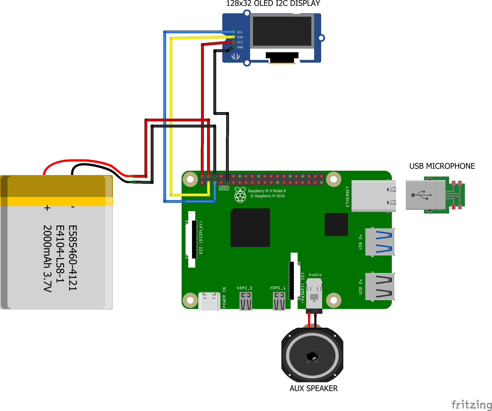

# 🏠 GPT Home 🤖💬


[](https://github.com/judahpaul16/gpt-home/tags)
[](https://hub.docker.com/r/judahpaul/gpt-home)

ChatGPT at home! Basically a better Google Nest Hub or Amazon Alexa home assistant. Built on the Raspberry Pi using the OpenAI API.


This guide will explain how to build your own. It's pretty straight forward. You can also use this as a reference for building other projects on the Raspberry Pi.

* *Theoretically, the app should run on any linux system thanks to docker, but I can only vouch for the versions listed in the [compatibility table](#-compatibility). You should be able use any plug-and-play USB/3.5mm speaker or microphone as long as it's supported by [ALSA](https://www.alsa-project.org) or [PortAudio](http://www.portaudio.com/docs/v19-doxydocs/index.html).*

<table align="center">

<tr>
<td>
  
<table>
<th colspan="2" style="text-align: center;">📦 Integrations</th>
<tr>
<td>
      
✅ OpenAI  
✅ Spotify  
✅ Philips Hue  
✅ OpenWeatherMap  
✅ Open-Meteo  

</td>
<td>

✅ Alarms  
✅ Reminders  
✅ Calendar (CalDAV)  
🔲 Home Assistant  
🔲 LiteLLM  

</td>
</tr>
</table>

</td>
<td>
    
<table>
<th colspan="2" style="text-align: center;">🔧 Use Cases
<tr>
<td>
      
☁️ Weather  
⏰ Alarms  
⌚ Reminders  
📆 Calendar  
☑️ To-Do List

</td>
<td>

📚 General Knowledge  
🗣️ Translation  
🎵 Music  
💡 Lights  
😆 Fun & Games

</td>
</tr>
</table>

</td>
</tr>

</table>


## 🚀 TL;DR
1. Make sure your OpenAI API key is exported with:
```bash
echo "export OPENAI_API_KEY='your_openai_api_key_here'" >> ~/.bashrc && source ~/.bashrc
```
2. Run the setup script with the `--no-build` flag to pull the latest image from DockerHub:
```bash
curl -s https://raw.githubusercontent.com/judahpaul16/gpt-home/main/contrib/setup.sh | \
    bash -s -- --no-build
```

## 🔌 Schematics
### ⚠️ Caution: Battery Connection
**IMPORTANT**: The image on the left is for illustration purposes. ***Do not connect the battery directly to the Raspberry Pi. Use a UPS or power supply with a battery like this [one](https://www.amazon.com/dp/B0C1GFX5LW?_encoding=UTF8&psc=1&ref_=cm_sw_r_cp_ud_dp_Z9X3PJZ7ZB8PCX42WHA6).*** Connecting the battery directly to the Raspberry Pi can cause damage to the board from voltage fluctuations.

Before connecting the battery, ensure that the polarity is correct to avoid damage to your Raspberry Pi or other components. Disconnect power sources before making changes.

<table style="border-collapse: collapse; border: 0;">
  <tr>
    <td style="border: none;"></td>
    <td style="border: none;"></td>
  </tr>
</table>
<span style="font-size: 1em; display:block;">[click to enlarge]</span>


---

## 🛠 My Parts List
This is the list of parts I used to build my first GPT Home. You can use this as a reference for building your own. I've also included optional parts that you can add to enhance your setup. ***To be clear you can use any system that runs Linux.***

<details>
<summary>👈 View My Parts List</summary>
<p>

**Core Components**  
- **Raspberry Pi 4B**: [Link](https://www.amazon.com/dp/B07TD43PDZ?_encoding=UTF8&psc=1&ref_=cm_sw_r_cp_ud_dp_3VPS3ADQ8ZXST3X89X93) - $50-$70
- **Mini Speaker**: [Link](https://www.amazon.com/dp/B01HB18IZ4?_encoding=UTF8&psc=1&ref_=cm_sw_r_cp_ud_dp_K4B3Z39KJ7ZWWQJ3NE57) - $18
- **128 GB MicroSD card**: [Link](https://www.amazon.com/dp/B09X7BK27V?_encoding=UTF8&ref_=cm_sw_r_cp_ud_dp_5P662VFED8EPHAB70JNF&th=1) - $13
- **USB 2.0 Mini Microphone**: [Link](https://www.amazon.com/dp/B01KLRBHGM?_encoding=UTF8&ref_=cm_sw_r_cp_ud_dp_TEE8RXB8QDPHZ97N556T&th=1) - $8

---

**Optional Components**  
- **128x32 OLED Display**: [Link](https://www.amazon.com/dp/B08CDN5PSJ?_encoding=UTF8&psc=1&ref_=cm_sw_r_cp_ud_dp_VHXY426Y4QR6VHNAJ34D) - $13-$14
- **Standoff Spacer Column M3x40mm**: [Link](https://www.amazon.com/dp/B07M7D8HMT?_encoding=UTF8&psc=1&ref_=cm_sw_r_cp_ud_dp_G9Y5DED2RVNWYEFCDGZJ) - $14
- **M1.4 M1.7 M2 M2.5 M3 Screw Kit**: [Link](https://www.amazon.com/dp/B08KXS2MWG?_encoding=UTF8&psc=1&ref_=cm_sw_r_cp_ud_dp_Q9TVWARHCPKVKGDHFY5S) - $15
- **Raspberry Pi UPS Power Supply with Battery**: [Link](https://www.amazon.com/dp/B0C1GFX5LW?_encoding=UTF8&psc=1&ref_=cm_sw_r_cp_ud_dp_Z9X3PJZ7ZB8PCX42WHA6) - $30
- **Cool Case for Raspberry Pi 4B**: [Link](https://www.amazon.com/dp/B07TTN1M7G?_encoding=UTF8&psc=1&ref_=cm_sw_r_cp_ud_dp_TMN6JDWCHFP8J7N98EV8) - $16

---

## 💲 Total Price Range
- **Core Components**: $102-$123
- **Optional Components**: $75
- **Total (Without Optional)**: $102-$123
- **Total (With Optional)**: $177-$198

---

</p>
</details>

## 📶 Configuring Wi-Fi via wpa_supplicant

To configure Wi-Fi on your Raspberry Pi, you'll need to edit the `wpa_supplicant.conf` file and ensure the wireless interface is enabled at boot. This method supports configuring multiple Wi-Fi networks and is suitable for headless setups.
*You could also use the [`raspi-config`](https://www.raspberrypi.com/documentation/computers/configuration.html) or the [`nmcli`](https://ubuntu.com/core/docs/networkmanager/configure-wifi-connections) utility to configure Wi-Fi; or simply use an Ethernet connection if you prefer.*

<details>
<summary>👈 View Instructions</summary>
<p>

**Step 1: Create the Bash Script**  

```bash
sudo nano /usr/local/bin/start_wifi.sh
```

Add the following content to the script:

```bash
#!/bin/bash

# Set the interface and SSID details
INTERFACE="wlan0"
SSID="your_wifi_ssid"
PASSWORD="your_wifi_password"

# Make sure no previous configuration interferes
sudo killall wpa_supplicant
sudo dhcpcd -x $INTERFACE

# Ensure the wireless interface is up
sudo ip link set $INTERFACE up

# Create a wpa_supplicant configuration file
WPA_CONF="/etc/wpa_supplicant/wpa_supplicant.conf"
wpa_passphrase "$SSID" "$PASSWORD" | sudo tee $WPA_CONF > /dev/null

# Start wpa_supplicant
sudo wpa_supplicant -B -i $INTERFACE -c $WPA_CONF

# Obtain an IP address
sudo dhcpcd $INTERFACE
```

Make sure to replace `your_wifi_ssid` and `your_wifi_password` with your actual WiFi network's SSID and password.

**Step 2: Make the Script Executable**  

```bash
sudo chmod +x /usr/local/bin/start_wifi.sh
```

**Step 3: Create a Systemd Service File**

```bash
sudo nano /etc/systemd/system/start_wifi.service
```

Add the following content to the service file:

```ini
[Unit]
Description=Start WiFi at boot
After=network.target

[Service]
ExecStart=/usr/local/bin/start_wifi.sh
RemainAfterExit=true

[Install]
WantedBy=multi-user.target
```

**Step 4: Reload Systemd and Enable the Service**

```bash
sudo systemctl daemon-reload
sudo systemctl enable start_wifi.service
sudo systemctl start start_wifi.service
```

Your Raspberry Pi should now connect to the Wi-Fi network automatically on boot.

If you want to connect to hidden networks or multiple networks, edit the `wpa_supplicant.conf` file located at `/etc/wpa_supplicant/wpa_supplicant.conf` and add the following configuration:

```bash
network={
    priority=1 # Higher priority networks are attempted first
    ssid="Your_Wi-Fi_Name"
    psk="Your_Wi-Fi_Password"
    key_mgmt=WPA-PSK
    scan_ssid=1 # Hidden network

    priority=2
    ssid="Enterprise_Wi-Fi_Name"
    key_mgmt=WPA-EAP
    eap=PEAP # or TTLS, TLS, FAST, LEAP
    identity="Your_Username"
    password="Your_Password" 
    phase1="peaplabel=0" # or "peapver=0" for PEAPv0
    phase2="auth=MSCHAPV2" # or "auth=MSCHAP" for MSCHAPv1
}
```

Restart the `wpa_supplicant` service to apply the changes:

```bash
sudo systemctl restart wpa_supplicant
```

See the [wpa_supplicant example file](https://w1.fi/cgit/hostap/plain/wpa_supplicant/wpa_supplicant.conf) for more information on the configuration options.

</p>
</details>

## 🛠 System Dependencies

Before running this project on your system, ensure your system clock is synchronized, your package lists are updated, and NGINX and Docker are installed. The setup script will take care of this for you but you can also do this manually.

<details>
<summary>👈 View Instructions</summary>
<p>

**Synchronize your system clock:**  
*Install `chrony` for time synchronization:*

```bash
sudo apt install -y chrony       # For Debian/Ubuntu
sudo yum install -y chrony       # For RHEL/CentOS/Alma
sudo dnf install -y chrony       # # For RHEL/CentOS/Alma 9^
sudo zypper install -y chrony    # For openSUSE
sudo pacman -S chrony            # For Arch Linux
```

Activate and synchronize time immediately with `chrony`:

```bash
sudo chronyc makestep
```

**Update your package list:**  
*Regular updates to your package list ensure access to the latest software and security patches.*

```bash
sudo apt update                   # For Debian/Ubuntu
sudo yum makecache                # For RHEL/CentOS/Alma
sudo dnf makecache                # For RHEL/CentOS/Alma 9^
sudo zypper refresh               # For openSUSE
sudo pacman -Sy                   # For Arch Linux
```

**Enable additional repositories:**  
*For systems that utilize EPEL and other special repositories, you may need to enable them to access a wider range of available packages.*

For Debian/Ubuntu:

```bash
sudo add-apt-repository universe
sudo apt update
```

For RHEL/CentOS/Alma and Fedora:

```bash
sudo yum install -y epel-release   # For RHEL/CentOS/Alma
sudo dnf install -y epel-release   # For RHEL/CentOS/Alma 9^
sudo yum makecache --timer            # For RHEL/CentOS/Alma
sudo dnf makecache --timer            # For RHEL/CentOS/Alma 9^
```

**Install Development Tools:**  
*Development tools are essential for building packages and compiling software. Ensure you have the necessary tools installed.*

For Debian/Ubuntu:

```bash
sudo apt install -y build-essential
```

For RHEL/CentOS/Alma and Fedora:

```bash
sudo yum groupinstall -y "Development Tools"   # For RHEL/CentOS/Alma 
sudo dnf groupinstall -y "Development Tools"   # For RHEL/CentOS/Alma 9^
```

**Install System Dependencies**  

1. **Docker**: Required for containerization.  
    ```bash
    sudo apt-get install -y docker.io  # For Debian/Ubuntu
    sudo yum install -y docker         # For RHEL/CentOS/Alma
    sudo dnf install -y docker         # For RHEL/CentOS/Alma 9^
    sudo zypper install -y docker      # For openSUSE
    sudo pacman -S docker              # For Arch Linux
    ```
    then `sudo systemctl enable --now docker`

2. **NGINX**: Required for reverse proxy for the web interface.  
    ```bash
    sudo apt-get install -y nginx   # For Debian/Ubuntu
    sudo yum install -y nginx       # For RHEL/CentOS/Alma
    sudo dnf install -y nginx       # For RHEL/CentOS/Alma 9^
    sudo zypper install -y nginx    # For openSUSE
    sudo pacman -S nginx            # For Arch Linux
    ```

</p>
</details>

---

## 🐳 Building the Docker Container
Before you run the setup script to build the container you should first export your `OPENAI_API_KEY` to an environment variable. The setup script will use this to initialize the container with your OpenAI API key.

***Note: Executing `export` directly in the terminal does not persist after reboot.***
```bash
export OPENAI_API_KEY="your_openai_api_key_here"
```

Alternatively, you can put this at the end of your `~/.bashrc` file. (recommended) 
```bash
# export your OpenAI API Key in here to initialize it at boot
export OPENAI_API_KEY="your_openai_api_key_here"

# Optional: Add these aliases to your .bashrc file for easier management
alias gpt-start="docker exec -it gpt-home supervisorctl start app"
alias gpt-restart="docker exec -it gpt-home supervisorctl restart app"
alias gpt-stop="docker exec -it gpt-home supervisorctl stop app"
alias gpt-status="docker exec -it gpt-home supervisorctl status app"
alias gpt-log="docker exec -it gpt-home tail -n 100 -f /app/src/events.log"

alias wi-start="docker exec -it gpt-home supervisorctl start web-interface"
alias wi-restart="docker exec -it gpt-home supervisorctl restart web-interface && sudo systemctl restart nginx"
alias wi-stop="docker exec -it gpt-home supervisorctl stop web-interface"
alias wi-status="docker exec -it gpt-home supervisorctl status web-interface"
alias wi-build="docker exec -it gpt-home bash -c 'cd /app/src/frontend && npm run build'"
alias wi-log="tail -n 100 -f /var/log/nginx/access.log"
alias wi-error="tail -n 100 -f /var/log/nginx/error.log"

alias spotifyd-start="docker exec -it gpt-home supervisorctl start spotifyd"
alias spotifyd-restart="docker exec -it gpt-home supervisorctl restart spotifyd"
alias spotifyd-stop="docker exec -it gpt-home supervisorctl stop spotifyd"
alias spotifyd-status="docker exec -it gpt-home supervisorctl status spotifyd"
alias spotifyd-log="docker exec -it gpt-home tail -n 100 -f /var/log/spotifyd.log"
```
Run `source ~/.bashrc` to apply the changes to your current terminal session.

The setup script will take quite a while to run ***(900.0s+ to build and setup dependencies on my quad-core Raspberry Pi 4B w/ 1G RAM)***. It will install all the dependencies and build the Docker container. However, you can skip the build process by passing the `--no-build` flag to the script; it will install the dependencies, set up the firewall and NGINX, and pull the container from Docker Hub and run it.

```bash
curl -s https://raw.githubusercontent.com/judahpaul16/gpt-home/main/contrib/setup.sh | \
    bash -s -- --no-build
```

**Alternatively, for development purposes, running `setup.sh` without the `--no-build` flag mounts the project directory to the container by adding `-v ~/gpt-home:/app` to the `docker run` command. This allows you to make changes to the project files on your Raspberry Pi and see the changes reflected in the container without rebuilding the image. This is useful for testing changes to the codebase. Run directly with:**

```bash
curl -s https://raw.githubusercontent.com/judahpaul16/gpt-home/main/contrib/setup.sh | \
    bash -s
```

You can also run the container interactively if you need to debug or test changes to the codebase with the `-it` (interactive terminal), `--entrypoint /bin/bash`, and `--rm` (remove on process exit) flags. This will drop you into a shell session inside the container. Alternatively, if the conatiner is already running:

```bash
docker exec -it gpt-home bash
```

This will start the container and drop you into a shell session inside the container.

**Explanation of Docker Run Flags**
```yaml
--tmpfs /run:
    Mounts a tmpfs at /run for transient runtime data.
--tmpfs /run/lock:
    Mounts a tmpfs at /run/lock for lock files.
--privileged:
    Grants extended privileges to the container
    Necessary for accessing host audio devices.
--net=host:
    Uses the host network stack directly.
    May be necessary for avahi-daemon services.
-v /dev/snd:/dev/snd:
    Provides access to the host's sound devices.
-v /dev/shm:/dev/shm:
    Provides access to shared memory.
-v /usr/share/alsa:/usr/share/alsa:ro:
    Maps the ALSA shared data as read-only.
-v /var/run/dbus:/var/run/dbus:
    Provides access to the D-Bus system for inter-process communication.
--mount type=bind,source=/etc/asound.conf,target=/etc/asound.conf:
    Binds the host's ALSA configuration to the container.
```

### 🐚 setup.sh
If you prefer to run the setup script manually, you can do so. Create a script in your ***home*** folder with `vim ~/setup.sh` or `nano ~/setup.sh` and paste in the following:

<details>
<summary>👈 View Script</summary>
<p>

```bash
#!/bin/bash

latest_release=$(curl -s https://api.github.com/repos/judahpaul16/gpt-home/releases/latest | grep 'tag_name' | cut -d\" -f4)

# Colors
RED='\033[0;31m'
GREEN='\033[0;32m'
YELLOW='\033[0;33m'
BLUE='\033[0;34m'
MAGENTA='\033[0;35m'
CYAN='\033[0;36m'
WHITE='\033[0;37m'
NC='\033[0m' # No Color

echo ""
echo -e "${MAGENTA}"
echo "GPT Home $latest_release"
echo "Created by Judah Paul"
echo "More info @ https://github.com/judahpaul16/gpt-home/"
echo -e "${NC}"

echo -e "${GREEN}"
echo "  ____ ____ _____   _   _                      "
echo " / ___|  _ \\_   _| | | | | ___  _ __ ___   ___ "
echo "| |  _| |_) || |   | |_| |/ _ \\| '_ \` _ \\ / _ \\"
echo "| |_| |  __/ | |   |  _  | (_) | | | | | |  __/"
echo " \\____|_|    |_|   |_| |_|\\___/|_| |_| |_|\\___|"
echo -e "${NC}"

echo -e "${CYAN}"
echo "         ______________"
echo "        | how may I    |"
echo "        | assist you   |"
echo "        | today?       |"
echo "        |______________|"
echo "                 \\                       |"
echo "                  \\                      |"
echo "                   \\                     |"
echo "   _______                   ________    |"
echo "  |ooooooo|      ____       | __  __ |   |"
echo "  |[]+++[]|     [____]      |/  \\/  \\|   |"
echo "  |+ ___ +|     ]()()[      |\\__/\\__/|   |"
echo "  |:|   |:|   ___\\__/___    |[][][][]|   |"
echo "  |:|___|:|  |__|    |__|   |++++++++|   |"
echo "  |[]===[]|   |_|/  \\|_|    | ______ |   |"
echo "_ ||||||||| _ | | __ | | __ ||______|| __|"
echo "  |_______|   |_|[::]|_|    |________|   \\"
echo "              \\_|_||_|_/                  \\"
echo "                |_||_|                     \\"
echo "               _|_||_|_                     \\"
echo "      ____    |___||___|                     \\"
echo -e "${NC}"

# Mask systemd-networkd-wait-online.service to prevent boot delays
sudo systemctl mask systemd-networkd-wait-online.service

# Set Permissions
sudo chown -R $(whoami):$(whoami) .
sudo chmod -R 755 .

# Function to install system dependencies
function install() {
    local package=$1
    echo "Ensuring package '$package' is installed..."

    # Detect the package management system
    if command -v apt-get >/dev/null; then
        if ! dpkg -s "$package" >/dev/null 2>&1; then
            sudo yes | add-apt-repository universe >/dev/null 2>&1 || true
            sudo apt update || true
            if [ "$package" == "docker" ]; then
                sudo apt-get install -y docker.io
            else
                sudo apt-get install -y "$package"
            fi
        fi
    elif command -v yum >/dev/null; then
        if ! rpm -q "$package" >/dev/null 2>&1; then
            sudo yum install -y epel-release >/dev/null 2>&1 || true
            sudo yum makecache --timer || true
            sudo yum install -y "$package"
        fi
    elif command -v dnf >/dev/null; then
        if ! dnf list installed "$package" >/dev/null 2>&1; then
            sudo dnf install -y epel-release >/dev/null 2>&1 || true
            sudo dnf makecache --timer || true
            sudo dnf install -y "$package"
        fi
    elif command -v zypper >/dev/null; then
        if ! zypper se -i "$package" >/dev/null 2>&1; then
            sudo zypper refresh || true
            sudo zypper install -y "$package"
        fi
    elif command -v pacman >/dev/null; then
        if ! pacman -Q "$package" >/dev/null 2>&1; then
            sudo pacman -Sy
            sudo pacman -S --noconfirm "$package"
        fi
    else
        echo "Package manager not supported."
        return 1
    fi

    if [ "$package" == "docker" ]; then
        if ! docker ps >/dev/null 2>&1; then
            echo "Docker installed. Adding $(whoami) to the 'docker' group..."
            sudo usermod -aG docker $(whoami)
            echo -e "${RED}User added to \`docker\` group but the session must be reloaded to access the Docker daemon. Please log out, log back in, and rerun the script. Exiting...${NC}"
            exit 0
        fi
    fi
}

install chrony
install nginx
install containerd
install docker
install docker-buildx-plugin
install alsa-utils
sudo systemctl enable docker
sudo systemctl start docker

# Create ALSA config (asound.conf, adjust as needed)
sudo tee /etc/asound.conf > /dev/null <<EOF
pcm.!default { type hw card 0 }
ctl.!default { type hw card 0 }
EOF

# Install Docker Buildx plugin
mkdir -p $HOME/.docker/cli-plugins
curl -Lo $HOME/.docker/cli-plugins/docker-buildx https://github.com/docker/buildx/releases/download/v0.14.0/buildx-v0.14.0.linux-arm64
sudo chmod +x $HOME/.docker/cli-plugins/docker-buildx
docker buildx version

# Setup UFW Firewall
echo "Setting up UFW Firewall..."
if which firewalld >/dev/null; then
    sudo systemctl stop firewalld
    sudo systemctl disable firewalld
    sudo yum remove firewalld -y 2>/dev/null || sudo apt-get remove firewalld -y 2>/dev/null || sudo zypper remove firewalld -y 2>/dev/null
fi
if ! which ufw >/dev/null; then
    sudo yum install ufw -y 2>/dev/null || sudo apt-get install ufw -y 2>/dev/null || sudo zypper install ufw -y 2>/dev/null
fi
sudo ufw allow ssh
sudo ufw allow 80,443/tcp
sudo ufw allow 5353/udp
echo "y" | sudo ufw enable

# Setup NGINX for reverse proxy
echo "Setting up NGINX..."
sudo mkdir -p /etc/nginx/sites-available /etc/nginx/sites-enabled
sudo tee /etc/nginx/sites-available/gpt-home <<EOF
server {
    listen 80;
    location / {
        proxy_pass http://127.0.0.1:8000/;
        proxy_set_header Host \$host;
        proxy_set_header X-Real-IP \$remote_addr;
        proxy_set_header X-Forwarded-For \$proxy_add_x_forwarded_for;
    }
}
EOF

# Remove gpt-home site symlink if it exists
[ -L "/etc/nginx/sites-enabled/gpt-home" ] && sudo unlink /etc/nginx/sites-enabled/gpt-home

# Remove the default site if it exists
[ -L "/etc/nginx/sites-enabled/default" ] && sudo unlink /etc/nginx/sites-enabled/default

# Create a symlink to the gpt-home site and reload NGINX
sudo ln -s /etc/nginx/sites-available/gpt-home /etc/nginx/sites-enabled
sudo systemctl enable nginx
sudo nginx -t && sudo systemctl restart nginx

sudo systemctl status --no-pager nginx

if [[ "$1" != "--no-build" ]]; then
    [ -d ~/gpt-home ] && rm -rf ~/gpt-home
    git clone https://github.com/judahpaul16/gpt-home ~/gpt-home
    cd ~/gpt-home
    echo "Checking if the container 'gpt-home' is already running..."
    if [ $(docker ps -q -f name=gpt-home) ]; then
        echo "Stopping running container 'gpt-home'..."
        docker stop gpt-home
    fi

    echo "Checking for existing container 'gpt-home'..."
    if [ $(docker ps -aq -f status=exited -f name=gpt-home) ]; then
        echo "Removing existing container 'gpt-home'..."
        docker rm -f gpt-home
    fi

    echo "Pruning Docker system..."
    docker system prune -f

    # Check if the buildx builder exists, if not create and use it
    if ! docker buildx ls | grep -q mybuilder; then
        docker buildx create --name mybuilder --use
        docker buildx inspect --bootstrap
    fi

    # Building Docker image 'gpt-home' for ARMhf architecture
    echo "Building Docker image 'gpt-home' for ARMhf..."
    timeout 3600 docker buildx build --platform linux/arm64 -t gpt-home --load .

    if [ $? -ne 0 ]; then
        echo "Docker build failed. Exiting..."
        exit 1
    fi

    echo "Container 'gpt-home' is now ready to run."

    echo "Running container 'gpt-home' from image 'gpt-home'..."
    docker run --restart unless-stopped -d --name gpt-home \
        --mount type=bind,source=/etc/asound.conf,target=/etc/asound.conf \
        --privileged \
        --net=host \
        --tmpfs /run \
        --tmpfs /run/lock \
        -v ~/gpt-home:/app \
        -v /dev/snd:/dev/snd \
        -v /dev/shm:/dev/shm \
        -v /usr/share/alsa:/usr/share/alsa \
        -v /var/run/dbus:/var/run/dbus \
        -e OPENAI_API_KEY=$OPENAI_API_KEY \
        gpt-home

    echo "Container 'gpt-home' is now running."

    # Show status of the container
    docker ps -a | grep gpt-home

    sleep 10

    # Show status of all programs managed by Supervisor
    docker exec -i gpt-home supervisorctl status
fi

if [[ "$1" == "--no-build" ]]; then
    docker ps -aq -f name=gpt-home | xargs -r docker rm -f
    docker pull judahpaul/gpt-home
    docker run --restart unless-stopped -d --name gpt-home \
        --mount type=bind,source=/etc/asound.conf,target=/etc/asound.conf \
        --privileged \
        --net=host \
        --tmpfs /run \
        --tmpfs /run/lock \
        -v /dev/snd:/dev/snd \
        -v /dev/shm:/dev/shm \
        -v /usr/share/alsa:/usr/share/alsa \
        -v /var/run/dbus:/var/run/dbus \
        -e OPENAI_API_KEY=$OPENAI_API_KEY \
        judahpaul/gpt-home
    docker ps -a | grep gpt-home
    sleep 10
    docker exec -i gpt-home supervisorctl status
fi
```

</p>
</details>

Be sure to make the script executable to run it
```bash
chmod +x setup.sh
./setup.sh
```

---

## ✅ Compatibility

<table align="center">
<tr valign="top">
    <!-- Raspberry Pi -->
    <td>
    <table>
        <tr><th colspan="2">Raspberry Pi</th></tr>
        <tr><td>3B</td><td>✅</td></tr>
        <tr><td>3B+</td><td>✅</td></tr>
        <tr><td>4B</td><td>✅</td></tr>
        <tr><td>5</td><td>❔</td></tr>
        <tr><td>Zero 2 W</td><td>✅</td></tr>
        <tr><td>Orange Pi 3B</td><td>✅</td></tr>
        <tr><td colspan=2><a href="https://learn.adafruit.com/circuitpython-on-orangepi-linux/circuitpython-orangepi">*Blinka only supports<br>the Orange Pi PC and<br>R1 if you're using i2c*</td></tr>
    </table>
    </td>
    <!-- Python -->
    <td>
    <table>
        <tr><th colspan="2">Python</th></tr>
        <tr><td>3.7</td><td>❌</td></tr>
        <tr><td>3.8</td><td>✅</td></tr>
        <tr><td>3.9</td><td>✅</td></tr>
        <tr><td>3.10</td><td>✅</td></tr>
        <tr><td>3.11</td><td>✅</td></tr>
        <tr><td>3.12</td><td>❌</td></tr>
    </table>
    </td>
    <!-- Operating Systems -->
    <td>
    <table>
        <tr><th colspan="2">Operating System</th></tr>
        <tr><td>Ubuntu 22.04</td><td>✅</td></tr>
        <tr><td>Ubuntu 23.04</td><td>✅</td></tr>
        <tr><td>Ubuntu 24.04</td><td>✅</td></tr>
        <tr><td>Debian Buster</td><td>✅</td></tr>
        <tr><td>Debian Bullseye</td><td>✅</td></tr>
        <tr><td>Alma Linux 8</td><td>✅</td></tr>
        <tr><td>Alma Linux 9</td><td>✅</td></tr>
    </table>
    </td>
    <!-- Node.js -->
    <td>
    <table>
        <tr><th colspan="2">Node.js</th></tr>
        <tr><td>17.x</td><td>❔</td></tr>
        <tr><td>18.x</td><td>✅</td></tr>
        <tr><td>19.x</td><td>❔</td></tr>
        <tr><td>20.x</td><td>❔</td></tr>
        <tr><td>21.x</td><td>❔</td></tr>
        <tr><td>22.x</td><td>❔</td></tr>
    </table>
    </td>
</tr>
</table>

---

## 📚 Useful Documentation

<table align="center">
<tr>
<td>

- [Raspberry Pi Docs](https://www.raspberrypi.com/documentation)
- [Docker Docs](https://docs.docker.com/)
- [Docker Buildx Docs](https://docs.docker.com/buildx/working-with-buildx/)
- [FastAPI Docs](https://fastapi.tiangolo.com/)
- [Ubuntu Server Docs](https://ubuntu.com/server/docs)
- [NGINX Docs](https://nginx.org/en/docs/)
- [React Docs](https://reactjs.org/docs/getting-started.html)
- [Node.js Docs](https://nodejs.org/en/docs/)
- [npm Docs](https://docs.npmjs.com/)

</td>
<td>

- [GPIO Pinout](https://www.raspberrypi.com/documentation/computers/images/GPIO-Pinout-Diagram-2.png)
- [Adafruit SSD1306 Docs](https://circuitpython.readthedocs.io/projects/ssd1306/en/latest/)
- [pyttsx3 Docs](https://pypi.org/project/pyttsx3/)
- [I2C Docs](https://i2c.readthedocs.io/en/latest/)
- [ALSA Docs](https://www.alsa-project.org/wiki/Documentation)
- [PortAudio Docs](http://www.portaudio.com/docs/v19-doxydocs/index.html)
- [SpeechRecognition Docs](https://pypi.org/project/SpeechRecognition/)
- [OpenAI API Docs](https://platform.openai.com/docs/introduction)
- [CalDAV API Docs](https://caldav.readthedocs.io/en/latest/)
- [LiteLLM Docs](https://docs.litellm.ai/docs/)

</td>
<td>

- [Spotify API Docs](https://developer.spotify.com/documentation/web-api/)
- [Spotify API Python Docs (Spotipy)](https://spotipy.readthedocs.io/)
- [Spotifyd Docs](https://docs.spotifyd.rs/)
- [Phillips Hue API Docs](https://developers.meethue.com/develop/get-started-2/)
- [Phillips Hue Python API Docs](https://github.com/studioimaginaire/phue)
- [OpenWeatherMap API Docs](https://openweathermap.org/api/one-call-3)
- [Open-Meteo API Docs](https://open-meteo.com/en/docs)
- [Python Crontab Docs](https://pypi.org/project/python-crontab/)
- [Fritzing Schematics](https://fritzing.org/)

</td>
</tr>
</table>

---

## 🤝 Contributing
Contributions are certainly welcome! Please read the [contributing guidelines](CONTRIBUTING.md) for more information on how to contribute.

## 📜 License
This project is licensed under the GNU GPL v3.0 License - see the [LICENSE](LICENSE) file for details.
