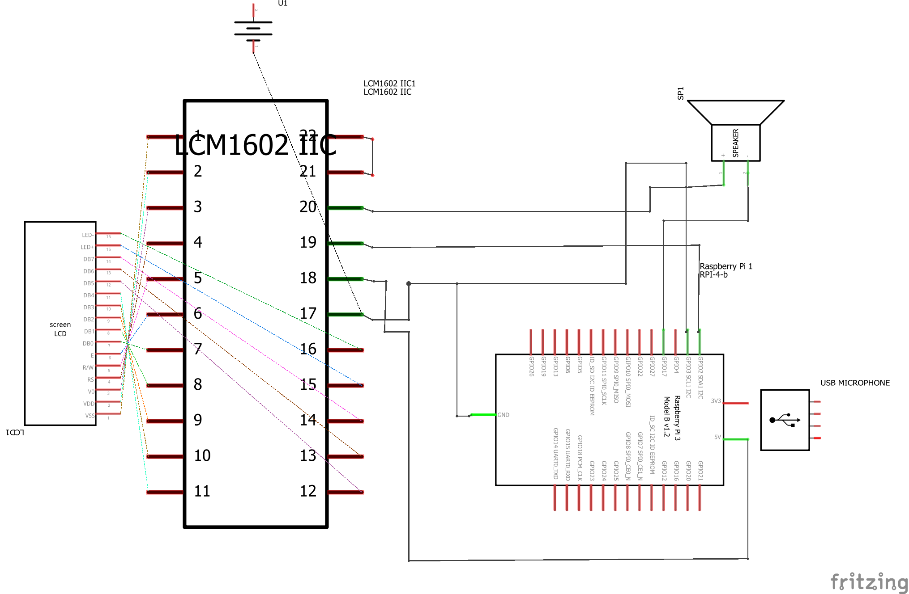
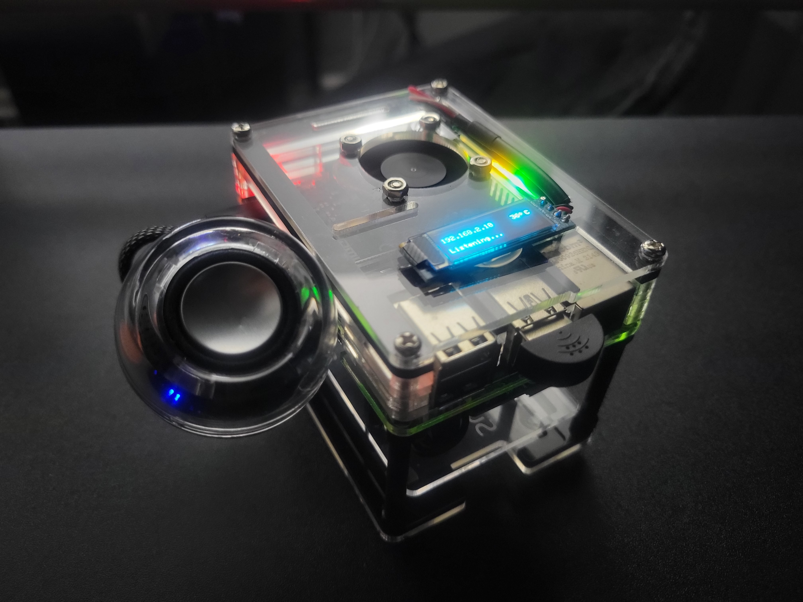

# 🏠 GPT Home
ChatGPT at home! Basically a better G**gle Nest Hub desk assistant made with Raspberry Pi and OpenAI API.

* *This guide assumes you're using Ubuntu Server as your Raspberry Pi operating system. You may need to make certain modifications to accomodate other operating systems*

## 📶 Configuring Wi-Fi via wpa_supplicant

To configure Wi-Fi on your Raspberry Pi, you'll need to edit the `wpa_supplicant.conf` file and ensure the wireless interface is enabled at boot.

1. Install `net-tools` to get the `ifconfig` command:
   ```bash
   sudo apt install net-tools
   ```

2. To enable the wireless interface (`wlan0` in most cases) at boot, add the following command to `/etc/rc.local` before the `exit 0` line:  
    *Create the file if it doesn't exist*
    ```bash
    sudo vim /etc/rc.local
    ```
    Add the following contents:
    ```bash
    #!/bin/bash
    sudo ifconfig wlan0 up &
    sudo wpa_supplicant -i wlan0 -c /etc/wpa_supplicant/wpa_supplicant.conf -B &
    sudo dhclient wlan0 &
    exit 0
    ```
    Ensure the file has executable permissions and is enabled as a service:
    ```bash
    sudo chmod +x /etc/rc.local
    sudo systemctl enable rc-local.service
    sudo systemctl start rc-local.service
    ```

3. Open the configuration file in a text editor:
    ```bash
    sudo vim /etc/wpa_supplicant/wpa_supplicant.conf
    ```

4. Add the following lines at the end of the file:  
*You can define multiple `network` blocks for multiple Wi-Fi networks*
    ```bash
    network={
        ssid="Your_Wi-Fi_Name"
        psk="Your_Wi-Fi_Password"
        key_mgmt=WPA-PSK
    }
    ```
    Replace `Your_Wi-Fi_Name` and `Your_Wi-Fi_Password` with your actual Wi-Fi credentials.

4. Ensure `wpa_supplicant` service starts at boot:
    ```bash
    sudo systemctl enable wpa_supplicant.service
    ```

5. Start `wpa_supplicant` service:
    ```bash
    sudo systemctl start wpa_supplicant.service
    ```

Your Raspberry Pi should now connect to the Wi-Fi network automatically on boot. If you face issues, refer to the [official Raspberry Pi documentation on wireless connectivity](https://www.raspberrypi.com/documentation/computers/configuration.html#setting-up-a-wireless-lan-via-the-command-line).

## 🛠 System Dependencies

Before running this project on your Raspberry Pi, you'll need to install some system-level dependencies in addition to the Python packages.

1. Synchoronize your system clock:
    ```bash
    sudo timedatectl set-ntp on
    ```

2. Update your package list:
    ```bash
    sudo apt update
    ```

2. Make sure the Universe repository is enabled:
    ```bash
    sudo add-apt-repository universe
    sudo apt update
    ```

### Installing Dependencies  
If you want to use the example setup script, you can skip this section.


1. **OpenAI API Key**: Required for OpenAI's GPT API.  
    Setup: Set up as an environment variable.  

2. **Python 3.x**: Required for running the Python code.  
   Installation: `sudo apt-get install -y python3 python3-dev`

3. **PortAudio**: Required for `pyttsx3` (text-to-speech).  
   Installation: `sudo apt-get install -y portaudio19-dev`

4. **ALSA Utilities**: Required for audio configuration.  
   Installation: `sudo apt-get install -y alsa-utils`

5. **JPEG Library**: Required for Pillow.  
   Installation: `sudo apt-get install -y libjpeg-dev`

6. **Build Essentials**: Required for building packages.  
   Installation: `sudo apt-get install -y build-essential`

7. **vcgencmd**: Comes pre-installed on Raspberry Pi OS. Used for fetching CPU temperature.

8. **Speech Recognition Libraries**: Required for `speech_recognition`.  
   Installation: `sudo apt-get install -y libasound2-dev`

9. **I2C Support**: Required for `adafruit_ssd1306` (OLED display).  
   Enable via `raspi-config` or install packages:  
   ```bash
   sudo apt-get install -y i2c-tools
   sudo apt-get install -y python3-smbus
   ```

10. **eSpeak Library**: Required for text-to-speech (`pyttsx3`).  
   Installation: `sudo apt-get install -y libespeak1`

11. **JACK Audio Connection Kit**: Required for handling audio.  
   Installation: `sudo apt-get install -y jackd2`  
   Select `Yes` when prompted to enable realtime privileges.

12. **FLAC Libraries**: Required for handling FLAC audio formats.  
   Installation: `sudo apt-get install -y flac libflac12:armhf`

13. **Git**: Required for cloning the repository.  
    Installation: `sudo apt-get install -y git`

14. **Node.js and npm**: Required for the web interface.  
    Installation: [Follow NodeSource Installation Guide](https://github.com/nodesource/distributions#installation-instructions)

15. **NGINX**: Required for reverse proxy for the web interface.
    Installation: `sudo apt-get install -y nginx`

16. **Virtual Environment**: Recommended for Python package management.  
   Installation: `sudo apt-get install -y python3-venv`

---

## 📜 Example Setup script:
First initialize an environment variable with your OpenAI API Key.  
*Note: Does not persist after reboot.*  
*If you want to set up the variable in .bashrc you can ignore this part.*  
```bash
export OPENAI_API_KEY="your_openai_api_key_here"
```
Create a script outside the local repo folder with `vim setup.sh`
```bash
#!/bin/bash

# Function to check and install a package if it's not installed
check_and_install() {
    package=$1
    install_cmd=$2

    if ! dpkg -l | grep -q $package; then
        echo "Installing $package..."
        eval $install_cmd
    else
        echo "$package is already installed."
    fi
}

# Function to update the system time
update_system_time() {
    echo "Updating system time..."
    check_and_install "ntpdate" "sudo apt-get install -y ntpdate"
    sudo ntpdate -u ntp.ubuntu.com
}

# Update system time
update_system_time

# Update package list
sudo apt update

# Check and install missing dependencies
check_and_install "python3" "sudo apt-get install -y python3 python3-dev"
check_and_install "portaudio19-dev" "sudo apt-get install -y portaudio19-dev"
check_and_install "alsa-utils" "sudo apt-get install -y alsa-utils"
check_and_install "libjpeg-dev" "sudo apt-get install -y libjpeg-dev"
check_and_install "build-essential" "sudo apt-get install -y build-essential"
check_and_install "libasound2-dev" "sudo apt-get install -y libasound2-dev"
check_and_install "i2c-tools" "sudo apt-get install -y i2c-tools"
check_and_install "python3-smbus" "sudo apt-get install -y python3-smbus"
check_and_install "libespeak1" "sudo apt-get install -y libespeak1"
check_and_install "jackd2" "sudo apt-get install -y jackd2"
check_and_install "flac" "sudo apt-get install -y flac"
check_and_install "libflac12:armhf" "sudo apt-get install -y libflac12:armhf"
check_and_install "cmake" "sudo apt-get install -y cmake"
check_and_install "openssl" "sudo apt-get install -y openssl"
check_and_install "git" "sudo apt-get install -y git"
check_and_install "nginx" "sudo apt-get install -y nginx"

# Function to setup a systemd service
setup_service() {
    # Parameters
    local SERVICE_NAME=$1
    local EXEC_START=$2
    local AFTER=$3
    local ENV=$4
    local LMEMLOCK=$5

    # Stop the service if it's already running
    sudo systemctl stop "$SERVICE_NAME" &>/dev/null

    echo "Creating and enabling $SERVICE_NAME..."
    # Create systemd service file
    cat <<EOF | sudo tee "/etc/systemd/system/$SERVICE_NAME" >/dev/null
[Unit]
Description=$SERVICE_NAME
After=$AFTER
StartLimitIntervalSec=500
StartLimitBurst=10

[Service]
User=ubuntu
WorkingDirectory=/home/ubuntu/gpt-home
ExecStart=$EXEC_START
$ENV
Restart=always
Type=simple
$LMEMLOCK

[Install]
WantedBy=multi-user.target
EOF

    # Reload systemd to recognize the new service, then enable and restart it
    sudo systemctl daemon-reload
    sudo systemctl enable "$SERVICE_NAME"
    sudo systemctl restart "$SERVICE_NAME"

    # Wait for 5 seconds and then show the service status
    echo ""
    sleep 5
    sudo systemctl status "$SERVICE_NAME" --no-pager
    echo ""
}

# Setup UFW Firewall
sudo ufw allow ssh
sudo ufw allow 80,443/tcp
echo "y" | sudo ufw enable

# Setup NGINX for reverse proxy
echo "Setting up NGINX..."
sudo tee /etc/nginx/sites-available/gpt-home <<EOF
server {
    listen 80;

    location / {
        proxy_pass http://localhost:8000/;
    }
}
EOF

# Remove existing symlink if it exists
[ -L "/etc/nginx/sites-enabled/gpt-home" ] && sudo unlink /etc/nginx/sites-enabled/gpt-home

# Symlink the site configuration
sudo ln -s /etc/nginx/sites-available/gpt-home /etc/nginx/sites-enabled

# Test the NGINX configuration
sudo nginx -t

# Remove the default site if it exists
[ -L "/etc/nginx/sites-enabled/default" ] && sudo unlink /etc/nginx/sites-enabled/default

# Reload NGINX to apply changes
sudo systemctl reload nginx

# Remove existing local repo if it exists
[ -d "gpt-home" ] && rm -rf gpt-home

# Clone gpt-home repo and navigate into its directory
git clone https://github.com/judahpaul16/gpt-home.git
cd gpt-home

## Setup main app
# Create and activate a virtual environment, then install dependencies
python3 -m venv env
source env/bin/activate
pip install --upgrade pip setuptools
pip install --use-pep517 -r requirements.txt

## Setup Web Interface
# Navigate to gpt-web and install dependencies
cd gpt-web
npm install

# Build the React App
npm run build

## Setup Services
# Setup gpt-home service
setup_service "gpt-home.service" "/bin/bash -c 'source /home/ubuntu/gpt-home/env/bin/activate && python /home/ubuntu/gpt-home/app.py'" "" "Environment=\"OPENAI_API_KEY=$OPENAI_API_KEY\"" "LimitMEMLOCK=infinity"

# Setup fastapi service for FastAPI backend
setup_service "gpt-web.service" "/bin/bash -c 'source /home/ubuntu/gpt-home/env/bin/activate && uvicorn gpt-web.backend:app --host 0.0.0.0 --port 8000'" "" "Environment=\"OPENAI_API_KEY=$OPENAI_API_KEY\"" ""

# Mask systemd-networkd-wait-online.service to prevent boot delays
sudo systemctl mask systemd-networkd-wait-online.service
```
Be sure to make the script executable to run it
```bash
chmod +x setup.sh
./setup.sh
```
(Optional) .bashrc helpers<br>
**Put this at the end of your ~/.bashrc file**
```bash
# export your OpenAI API Key in here to initialize it at boot
export OPENAI_API_KEY="your_openai_api_key_here"

alias gpt-start="sudo systemctl start gpt-home"
alias gpt-restart="sudo systemctl restart gpt-home"
alias gpt-stop="sudo systemctl stop gpt-home"
alias gpt-disable="sudo systemctl disable gpt-home"
alias gpt-status="sudo systemctl status gpt-home"
alias gpt-enable="sudo systemctl enable gpt-home"
alias gpt-log="tail -n 100 -f /home/ubuntu/gpt-home/events.log"

alias web-start="sudo systemctl start gpt-web"
alias web-restart="sudo systemctl restart gpt-web"
alias web-stop="sudo systemctl stop gpt-web"
alias web-disable="sudo systemctl disable gpt-web"
alias web-status="sudo systemctl status gpt-web"
alias web-enable="sudo systemctl enable gpt-web"
alias web-log="tail -n 100 -f /var/log/nginx/access.log"
alias web-error="tail -n 100 -f /var/log/nginx/error.log"
```

---

## ⚠️ Schematics / Wiring Diagram
### Caution: Battery Connection
**IMPORTANT**: Before connecting the battery, ensure that the polarity is correct to avoid damage to your Raspberry Pi or other components. Disconnect power sources before making changes.

<table style="border-collapse: collapse; border: 0;">
  <tr>
    <td style="border: none;"></td>
    <td style="border: none;"></td>
  </tr>
</table>
<span style="font-size: 1em; display:block;">[click to enlarge]</span>

---

## 📸 My Build

<span style="font-size: 1em; display:block;">[click to enlarge]</span>

---

## 🛠 My Parts List

### Core Components
- **Raspberry Pi 4B**: [Link](https://a.co/d/aH6YCXY) - $50-$70
- **Mini Speaker**: [Link](https://a.co/d/9bN8LZ2) - $18
- **128x32 OLED Display**: [Link](https://a.co/d/4Scrfjq) - $13-$14
- **128 GB MicroSD card**: [Link](https://a.co/d/0SxSg7O) - $13
- **USB 2.0 Mini Microphone**: [Link](https://a.co/d/eIrQUXC) - $8

---

### 🌟 Optional Components
- **Standoff Spacer Column M3x40mm**: [Link](https://a.co/d/ees6oEA) - $14
- **M1.4 M1.7 M2 M2.5 M3 Screw Kit**: [Link](https://a.co/d/4XJwiBY) - $15
- **Raspberry Pi UPS Power Supply with Battery**: [Link](https://a.co/d/1rMMCPR) - $30
- **Cool Case for Raspberry Pi 4B**: [Link](https://a.co/d/idSKJIG) - $16

---

## 💲 Total Price Range
- **Core Components**: $102-$123
- **Optional Components**: $75
- **Total (Without Optional)**: $102-$123
- **Total (With Optional)**: $177-$198

---

## 📚 Useful Documentation

<table>
<tr>
<td>

- [Raspberry Pi Docs](https://www.raspberrypi.com/documentation)
- [GPIO Pinout](https://www.raspberrypi.com/documentation/computers/images/GPIO-Pinout-Diagram-2.png)
- [OpenAI API Docs](https://beta.openai.com/docs/introduction)
- [Requests Docs](https://pypi.org/project/requests/)
- [PortAudio Docs](http://www.portaudio.com/docs/v19-doxydocs/index.html)
- [Python3 Docs](https://docs.python.org/3/)
- [Node.js Docs](https://nodejs.org/en/docs/)
- [npm Docs](https://docs.npmjs.com/)
- [Fritzing Schematics](https://fritzing.org/)

</td>
<td>

- [React Docs](https://reactjs.org/docs/getting-started.html)
- [FastAPI Docs](https://fastapi.tiangolo.com/)
- [NGINX Docs](https://nginx.org/en/docs/)
- [JACK Audio Connection Kit Docs](https://jackaudio.org/api/index.html)
- [SpeechRecognition Docs](https://pypi.org/project/SpeechRecognition/)
- [pyttsx3 Docs](https://pypi.org/project/pyttsx3/)
- [eSpeak Docs](http://espeak.sourceforge.net/commands.html)
- [I2C Docs](https://i2c.readthedocs.io/en/latest/)
- [ALSA Docs](https://www.alsa-project.org/wiki/Documentation)

</td>
</tr>
</table>
