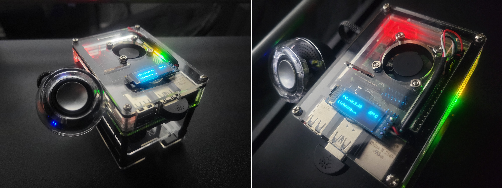
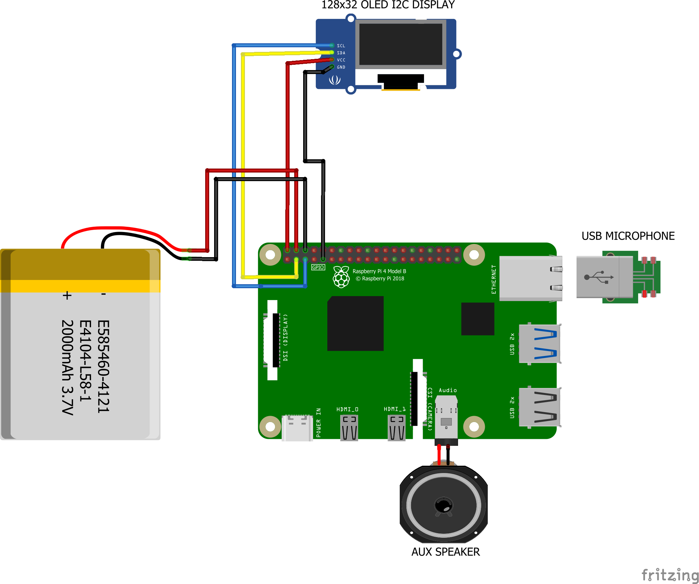
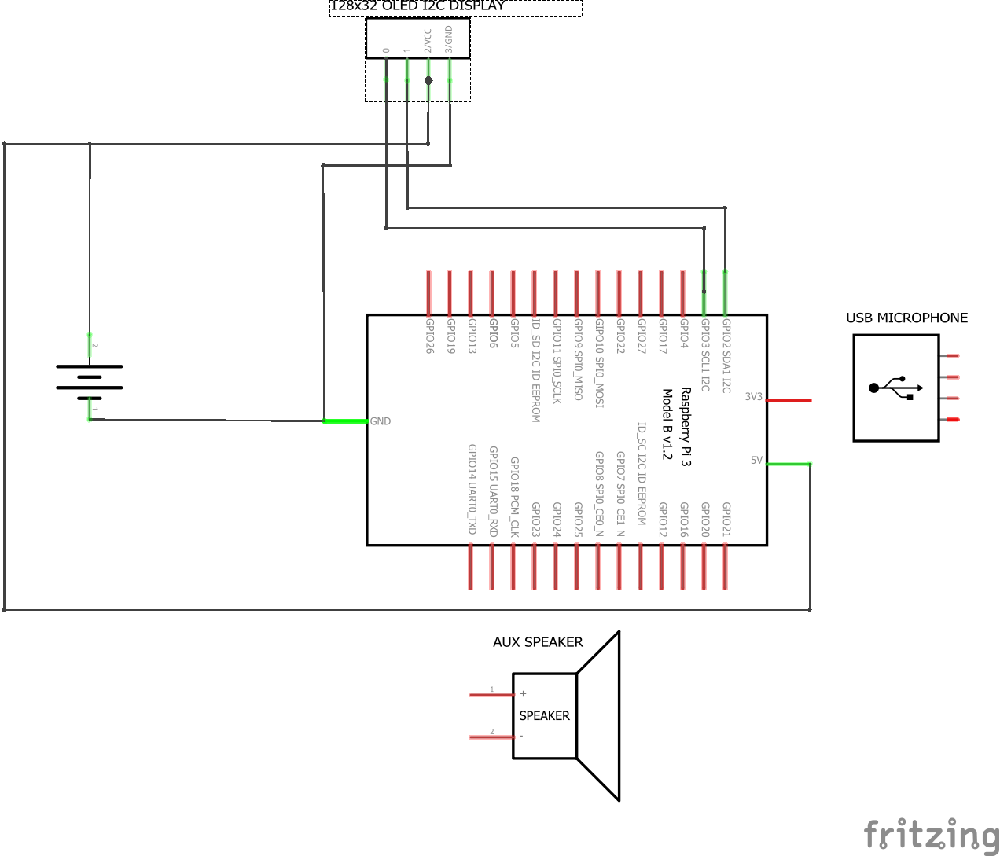

# 🏠 GPT Home 🤖💬


[](https://github.com/judahpaul16/gpt-home/tags)
[](https://hub.docker.com/r/judahpaul/gpt-home)

ChatGPT at home! Basically a better Google Nest Hub or Amazon Alexa home assistant. Built on the Raspberry P iusing LiteLLM and LangGraph.



This guide will explain how to build your own. It's pretty straight forward. You can also use this as a reference for building other projects on the Raspberry Pi.

* *Theoretically, the app should run on any linux system thanks to docker, but I can only vouch for the versions listed in the [compatibility table](#-compatibility). You should be able use any plug-and-play USB/3.5mm speaker or microphone as long as it's supported by [ALSA](https://www.alsa-project.org) or [PortAudio](http://www.portaudio.com/docs/v19-doxydocs/index.html).*

<table align="center">

<tr>
<td>
  
<table>
<th colspan="2" style="text-align: center;">📦 Integrations</th>
<tr>
<td>
      
✅ OpenAI  
✅ Spotify  
✅ Philips Hue  
✅ OpenWeatherMap  
✅ Open-Meteo  
✅ Alarms  
✅ Reminders  

</td>
<td>

✅ Calendar (CalDAV)  
✅ LiteLLM  
✅ LangGraph  
✅ Persistent Memory  
✅ Display Support  
🔲 Zigbee2MQTT  

</td>
</tr>
</table>

</td>
<td>
    
<table>
<th colspan="2" style="text-align: center;">🔧 Use Cases
<tr>
<td>
      
☁️ Weather  
⏰ Alarms  
⌚ Reminders  
📆 Calendar  
☑️ To-Do List

</td>
<td>

📚 General Knowledge  
🗣️ Translation  
🎵 Music  
💡 Lights  
😆 Fun & Games

</td>
</tr>
</table>

</td>
</tr>

</table>

> 📖 **Developer Documentation**: For in-depth technical documentation, architecture details, and API references, visit the [**GPT Home Wiki**](https://github.com/judahpaul16/gpt-home/wiki).

## 🧠 Architecture

GPT Home uses a **microservices architecture** with Docker Compose:

| Service | Description | Port | Profile |
|---------|-------------|------|---------|
| `db` | PostgreSQL + pgvector for memory storage | 5432 (internal) | always |
| `nginx` | Reverse proxy (routes API→backend:8000, static→frontend:80) | **80** (exposed) | always |
| `backend` | Voice assistant + FastAPI backend | 8000 (internal) | always |
| `frontend` | Pre-built React static files (nginx) | 80 (internal) | prod |
| `frontend-dev` | React dev server with hot reload (network alias: "frontend") | 80 (internal) | dev |
| `spotify` | Spotify Connect + Avahi mDNS (gpt-home.local) | host network | always |

> **Profiles:** Default is `prod` (set via `COMPOSE_PROFILES=prod` in `.env`). Use `COMPOSE_PROFILES=dev` for development with hot reload. Just run `docker compose up -d` — no `--profile` flag needed.

**Nginx Routing:**
- `/api/*`, `/logs/*`, `/settings`, `/spotify-*`, `/connect-service`, etc. → `backend:8000`
- `/*` (everything else) → `frontend:80` (prod: static nginx, dev: React dev server)

**Core Technologies:**
- **LangGraph**: Orchestrates the AI agent workflow
- **LangMem**: Manages long-term memory extraction and retrieval
- **PostgreSQL + pgvector**: Stores conversation history and semantic memories
- **LiteLLM**: Multi-provider LLM/TTS/STT support (100+ providers)
- **Display System**: Auto-detecting multi-display support (HDMI, SPI/TFT, I2C)

## 🚀 TL;DR

### Production (Raspberry Pi)
```bash
curl -s https://raw.githubusercontent.com/judahpaul16/gpt-home/main/contrib/setup.sh | \
    bash -s -- --no-build
```
2. ***Required:*** Set your API key. GPT Home uses **LiteLLM** which supports 100+ providers (OpenAI, Anthropic, Google, Cohere, etc.):
```bash
echo "LITELLM_API_KEY=YOUR_API_KEY_HERE" >> ~/gpt-home/.env
docker compose restart
```

> **Tip:** You can also set the API key via the web interface at `gpt-home.local/settings`. See [LiteLLM docs](https://docs.litellm.ai/docs/providers) for all supported providers.

3. ***Optional:*** To view the logs and verify the assistant is running:
```bash
docker compose logs -f
```

### Development (Any Machine)
```bash
git clone https://github.com/judahpaul16/gpt-home.git
cd gpt-home
cp .env.example .env
# Edit .env with your API keys
nano .env
# Start dev environment with hot reload
COMPOSE_PROFILES=dev docker compose up
```
Access at `http://localhost` (nginx routes to frontend and API).

## 🔌 Schematics
### ⚠️ Caution: Battery Connection
**IMPORTANT**: The image on the left is for illustration purposes. ***Do not connect the battery directly to the Raspberry Pi. Use a UPS or power supply with a battery like this [one](https://www.amazon.com/dp/B0C1GFX5LW?_encoding=UTF8&psc=1&ref_=cm_sw_r_cp_ud_dp_Z9X3PJZ7ZB8PCX42WHA6).*** Connecting the battery directly to the Raspberry Pi can cause damage to the board from voltage fluctuations.

Before connecting the battery, ensure that the polarity is correct to avoid damage to your Raspberry Pi or other components. Disconnect power sources before making changes.

<table style="border-collapse: collapse; border: 0;">
  <tr>
    <td style="border: none;"></td>
    <td style="border: none;"></td>
  </tr>
</table>
<span style="font-size: 1em; display:block;">[click to enlarge]</span>


---

## 🛠 My Parts List
This is the list of parts I used to build my first GPT Home. You can use this as a reference for building your own. I've also included optional parts that you can add to enhance your setup. ***To be clear you can use any system that runs Linux.***

<details>
<summary>👈 View My Parts List</summary>
<p>

**Core Components**  
- **Raspberry Pi 4B**: [Link](https://www.amazon.com/dp/B07TD43PDZ?_encoding=UTF8&psc=1&ref_=cm_sw_r_cp_ud_dp_3VPS3ADQ8ZXST3X89X93) - $50-$70
- **Mini Speaker**: [Link](https://www.amazon.com/dp/B01HB18IZ4?_encoding=UTF8&psc=1&ref_=cm_sw_r_cp_ud_dp_K4B3Z39KJ7ZWWQJ3NE57) - $18
- **128 GB MicroSD card**: [Link](https://www.amazon.com/dp/B09X7BK27V?_encoding=UTF8&ref_=cm_sw_r_cp_ud_dp_5P662VFED8EPHAB70JNF&th=1) - $13
- **USB 2.0 Mini Microphone**: [Link](https://www.amazon.com/dp/B01KLRBHGM?_encoding=UTF8&ref_=cm_sw_r_cp_ud_dp_TEE8RXB8QDPHZ97N556T&th=1) - $8

---

**Optional Components**  
- **128x32 I2C OLED Display**: [Link](https://www.amazon.com/dp/B08CDN5PSJ?_encoding=UTF8&psc=1&ref_=cm_sw_r_cp_ud_dp_VHXY426Y4QR6VHNAJ34D) - $13-$14
- **3.5" TFT LCD Display (480x320)**: [Link](https://www.amazon.com/dp/B0BJDTL9J3) - $15-$20 (SPI, ILI9341) — auto-detected by setup script
- **7" HDMI Touchscreen**: [Link](https://www.amazon.com/Hosyond-Display-1024%C3%97600-Capacitive-Raspberry/dp/B09XKC53NH) - $40-$60 (1024x600)
- **Standoff Spacer Column M3x40mm**: [Link](https://www.amazon.com/dp/B07M7D8HMT?_encoding=UTF8&psc=1&ref_=cm_sw_r_cp_ud_dp_G9Y5DED2RVNWYEFCDGZJ) - $14
- **M1.4 M1.7 M2 M2.5 M3 Screw Kit**: [Link](https://www.amazon.com/dp/B08KXS2MWG?_encoding=UTF8&psc=1&ref_=cm_sw_r_cp_ud_dp_Q9TVWARHCPKVKGDHFY5S) - $15
- **Raspberry Pi UPS Power Supply with Battery**: [Link](https://www.amazon.com/dp/B0C1GFX5LW?_encoding=UTF8&psc=1&ref_=cm_sw_r_cp_ud_dp_Z9X3PJZ7ZB8PCX42WHA6) - $30
- **Cool Case for Raspberry Pi 4B**: [Link](https://www.amazon.com/dp/B07TTN1M7G?_encoding=UTF8&psc=1&ref_=cm_sw_r_cp_ud_dp_TMN6JDWCHFP8J7N98EV8) - $16

---

## 💲 Total Price Range
- **Core Components**: $102-$123
- **Optional Components**: $75
- **Total (Without Optional)**: $102-$123
- **Total (With Optional)**: $177-$198

---

</p>
</details>

## 📶 Configuring Wi-Fi via wpa_supplicant

To configure Wi-Fi on your Raspberry Pi, you'll need to edit the `wpa_supplicant.conf` file and ensure the wireless interface is enabled at boot. This method supports configuring multiple Wi-Fi networks and is suitable for headless setups.
*You could also use the [`raspi-config`](https://www.raspberrypi.com/documentation/computers/configuration.html) or the [`nmcli`](https://ubuntu.com/core/docs/networkmanager/configure-wifi-connections) utility to configure Wi-Fi; or simply use an Ethernet connection if you prefer.*

<details>
<summary>👈 View Instructions</summary>
<p>

**Step 1: Create the Bash Script**  

```bash
sudo nano /usr/local/bin/start_wifi.sh
```

Add the following content to the script:

```bash
#!/bin/bash

# Set the interface and SSID details
INTERFACE="wlan0"
SSID="your_wifi_ssid"
PASSWORD="your_wifi_password"

# Make sure no previous configuration interferes
sudo killall wpa_supplicant
sudo dhcpcd -x $INTERFACE

# Ensure the wireless interface is up
sudo ip link set $INTERFACE up

# Create a wpa_supplicant configuration file
WPA_CONF="/etc/wpa_supplicant/wpa_supplicant.conf"
wpa_passphrase "$SSID" "$PASSWORD" | sudo tee $WPA_CONF > /dev/null

# Start wpa_supplicant
sudo wpa_supplicant -B -i $INTERFACE -c $WPA_CONF

# Obtain an IP address
sudo dhcpcd $INTERFACE
```

Make sure to replace `your_wifi_ssid` and `your_wifi_password` with your actual WiFi network's SSID and password.

**Step 2: Make the Script Executable**  

```bash
sudo chmod +x /usr/local/bin/start_wifi.sh
```

**Step 3: Create a Systemd Service File**

```bash
sudo nano /etc/systemd/system/start_wifi.service
```

Add the following content to the service file:

```ini
[Unit]
Description=Start WiFi at boot
After=network.target

[Service]
ExecStart=/usr/local/bin/start_wifi.sh
RemainAfterExit=true

[Install]
WantedBy=multi-user.target
```

**Step 4: Reload Systemd and Enable the Service**

```bash
sudo systemctl daemon-reload
sudo systemctl enable start_wifi.service
sudo systemctl start start_wifi.service
```

Your Raspberry Pi should now connect to the Wi-Fi network automatically on boot.

If you want to connect to hidden networks or multiple networks, edit the `wpa_supplicant.conf` file located at `/etc/wpa_supplicant/wpa_supplicant.conf` and add the following configuration:

```bash
network={
    priority=1 # Higher priority networks are attempted first
    ssid="Your_Wi-Fi_Name"
    psk="Your_Wi-Fi_Password"
    key_mgmt=WPA-PSK
    scan_ssid=1 # Hidden network

    priority=2
    ssid="Enterprise_Wi-Fi_Name"
    key_mgmt=WPA-EAP
    eap=PEAP # or TTLS, TLS, FAST, LEAP
    identity="Your_Username"
    password="Your_Password" 
    phase1="peaplabel=0" # or "peapver=0" for PEAPv0
    phase2="auth=MSCHAPV2" # or "auth=MSCHAP" for MSCHAPv1
}
```

Restart the `wpa_supplicant` service to apply the changes:

```bash
sudo systemctl restart wpa_supplicant
```

See the [wpa_supplicant example file](https://w1.fi/cgit/hostap/plain/wpa_supplicant/wpa_supplicant.conf) for more information on the configuration options.

</p>
</details>

## 🛠 System Dependencies

Before running this project on your system, ensure your system clock is synchronized, your package lists are updated, and Docker is installed. The setup script will take care of this for you but you can also do this manually.

<details>
<summary>👈 View Instructions</summary>
<p>

**Synchronize your system clock:**  
*Install `chrony` for time synchronization:*

```bash
sudo apt install -y chrony       # For Debian/Ubuntu
sudo yum install -y chrony       # For RHEL/CentOS/Alma
sudo dnf install -y chrony       # # For RHEL/CentOS/Alma 9^
sudo zypper install -y chrony    # For openSUSE
sudo pacman -S chrony            # For Arch Linux
```

Activate and synchronize time immediately with `chrony`:

```bash
sudo chronyc makestep
```

**Update your package list:**  
*Regular updates to your package list ensure access to the latest software and security patches.*

```bash
sudo apt update                   # For Debian/Ubuntu
sudo yum makecache                # For RHEL/CentOS/Alma
sudo dnf makecache                # For RHEL/CentOS/Alma 9^
sudo zypper refresh               # For openSUSE
sudo pacman -Sy                   # For Arch Linux
```

**Enable additional repositories:**  
*For systems that utilize EPEL and other special repositories, you may need to enable them to access a wider range of available packages.*

For Debian/Ubuntu:

```bash
sudo add-apt-repository universe
sudo apt update
```

For RHEL/CentOS/Alma and Fedora:

```bash
sudo yum install -y epel-release   # For RHEL/CentOS/Alma
sudo dnf install -y epel-release   # For RHEL/CentOS/Alma 9^
sudo yum makecache --timer            # For RHEL/CentOS/Alma
sudo dnf makecache --timer            # For RHEL/CentOS/Alma 9^
```

**Install Development Tools:**  
*Development tools are essential for building packages and compiling software. Ensure you have the necessary tools installed.*

For Debian/Ubuntu:

```bash
sudo apt install -y build-essential
```

For RHEL/CentOS/Alma and Fedora:

```bash
sudo yum groupinstall -y "Development Tools"   # For RHEL/CentOS/Alma 
sudo dnf groupinstall -y "Development Tools"   # For RHEL/CentOS/Alma 9^
```

**Install System Dependencies**  

1. **Docker**: Required for containerization.  
    ```bash
    sudo apt-get install -y docker.io  # For Debian/Ubuntu
    sudo yum install -y docker         # For RHEL/CentOS/Alma
    sudo dnf install -y docker         # For RHEL/CentOS/Alma 9^
    sudo zypper install -y docker      # For openSUSE
    sudo pacman -S docker              # For Arch Linux
    ```
    then `sudo systemctl enable --now docker`

> **Note:** NGINX is now containerized and runs automatically via Docker Compose.

</p>
</details>

---

## 🐳 Building the Docker Container
***Note: GPT Home uses LiteLLM which supports 100+ LLM providers. Set your `LITELLM_API_KEY` in the `.env` file or via the web interface at `gpt-home.local/settings`. See the [LiteLLM docs](https://docs.litellm.ai/docs/providers) for supported providers.***

***Optional: Add these aliases to your .bashrc file for easier management.***
```bash
# Set working directory
alias gpt-home="cd ~/gpt-home"

# Manage all services
alias gpt-up="cd ~/gpt-home && docker compose up -d"
alias gpt-down="cd ~/gpt-home && docker compose down"
alias gpt-restart="cd ~/gpt-home && docker compose restart"
alias gpt-logs="cd ~/gpt-home && docker compose logs -f"
alias gpt-status="cd ~/gpt-home && docker compose ps"

# Manage individual services
alias gpt-backend-logs="cd ~/gpt-home && docker compose logs -f backend"
alias gpt-backend-restart="cd ~/gpt-home && docker compose restart backend"
alias gpt-backend-shell="cd ~/gpt-home && docker compose exec backend bash"

alias gpt-frontend-logs="cd ~/gpt-home && docker compose logs -f frontend"
alias gpt-frontend-restart="cd ~/gpt-home && docker compose restart frontend"

alias gpt-nginx-logs="cd ~/gpt-home && docker compose logs -f nginx"
alias gpt-nginx-restart="cd ~/gpt-home && docker compose restart nginx"

alias gpt-spotify-logs="cd ~/gpt-home && docker compose logs -f spotify"
alias gpt-spotify-restart="cd ~/gpt-home && docker compose restart spotify"

# Development mode (hot reload)
alias gpt-dev="cd ~/gpt-home && COMPOSE_PROFILES=dev docker compose up"
```
Run `source ~/.bashrc` to apply the changes to your current terminal session.

The setup script will take quite a while to run ***(900.0s+ to build and setup dependencies on my quad-core Raspberry Pi 4B w/ 1G RAM)***. It will install all the dependencies and build the Docker containers. However, you can skip the build process by passing the `--no-build` flag to the script; it will install the dependencies, set up the firewall, and pull the containers from Docker Hub and run them.

```bash
curl -s https://raw.githubusercontent.com/judahpaul16/gpt-home/main/contrib/setup.sh | \
    bash -s -- --no-build
```

**Alternatively, for development purposes, running `setup.sh` without the `--no-build` flag builds all the service images locally. This is useful for testing changes to the codebase.**

```bash
curl -s https://raw.githubusercontent.com/judahpaul16/gpt-home/main/contrib/setup.sh | \
    bash -s
```

You can also access a shell inside a running container for debugging:

```bash
docker compose exec backend bash   # Voice assistant container
docker compose exec frontend bash  # Web server container
docker compose exec nginx sh       # NGINX container
```

**Explanation of Docker Compose Configuration**

The `docker-compose.yml` configures six services:

```yaml
services:
  db:
    # PostgreSQL with pgvector for persistent memory storage
    image: pgvector/pgvector:0.8.1-pg18-trixie
    volumes:
      - postgres-data:/var/lib/postgresql/data

  nginx:
    # Reverse proxy - routes /api, /logs, /settings to backend; static to frontend
    image: nginx:alpine
    ports: ["80:80"]
    depends_on: [backend]

  backend:
    # Voice assistant (app.py) + FastAPI backend (backend.py) on :8000
    image: judahpaul/gpt-home-backend:latest
    privileged: true
    expose: ["8000"]
    devices: ["/dev/snd:/dev/snd", "/dev/i2c-1:/dev/i2c-1", "/dev/dri:/dev/dri"]

  frontend:             # Production (profile: prod)
    # Multi-stage build: React static files served by nginx
    image: judahpaul/gpt-home-frontend:latest
    expose: ["80"]

  frontend-dev:         # Development (profile: dev)
    # React dev server with hot reload
    build: compose/web/Dockerfile.dev
    expose: ["80"]
    volumes:
      - ./src/frontend:/app  # Hot reload

  spotify:
    # Spotify Connect + Avahi mDNS
    image: judahpaul/gpt-home-spotify:latest
    network_mode: host  # Required for mDNS discovery
```

> **Profiles:** By default, `COMPOSE_PROFILES=prod` is set in `.env`, so `frontend` runs. For development with hot reload, use `COMPOSE_PROFILES=dev docker compose up`.

**Setup Script Flags**

The `setup.sh` script supports the following flags:

| Flag | Description |
|------|-------------|
| `--no-build` | Skip building and pull the pre-built image from Docker Hub instead |
| `--no-cache` | Build without using Docker's cache (forces fresh build) |
| `--prune` | Prune Docker system and volumes before building (cleans up disk space) |

**Examples:**
```bash
# Default build (uses cache, no prune)
./setup.sh

# Pull from Docker Hub without building
./setup.sh --no-build

# Fresh build without cache
./setup.sh --no-cache

# Full cleanup and fresh build
./setup.sh --prune --no-cache
```

### 🐚 setup.sh
If you prefer to run the setup script manually, you can do so. Create a script in your ***home*** folder with `vim ~/setup.sh` or `nano ~/setup.sh` and paste in the following:

<details>
<summary>👈 View Script</summary>
<p>

```bash
#!/bin/bash

latest_release=$(curl -s https://api.github.com/repos/judahpaul16/gpt-home/releases/latest | grep 'tag_name' | cut -d\" -f4)

# Colors
RED='\033[0;31m'
GREEN='\033[0;32m'
YELLOW='\033[0;33m'
BLUE='\033[0;34m'
MAGENTA='\033[0;35m'
CYAN='\033[0;36m'
WHITE='\033[0;37m'
NC='\033[0m' # No Color

echo ""
echo -e "${MAGENTA}"
echo "GPT Home $latest_release"
echo "Created by Judah Paul"
echo "More info @ https://github.com/judahpaul16/gpt-home/"
echo -e "${NC}"

echo -e "${GREEN}"
echo "  ____ ____ _____   _   _                      "
echo " / ___|  _ \\_   _| | | | | ___  _ __ ___   ___ "
echo "| |  _| |_) || |   | |_| |/ _ \\| '_ \` _ \\ / _ \\"
echo "| |_| |  __/ | |   |  _  | (_) | | | | | |  __/"
echo " \\____|_|    |_|   |_| |_|\\___/|_| |_| |_|\\___|"
echo -e "${NC}"

echo -e "${CYAN}"
echo "         ______________"
echo "        | how may I    |"
echo "        | assist you   |"
echo "        | today?       |"
echo "        |______________|"
echo "                 \\                       |"
echo "                  \\                      |"
echo "                   \\                     |"
echo "   _______                   ________    |"
echo "  |ooooooo|      ____       | __  __ |   |"
echo "  |[]+++[]|     [____]      |/  \\/  \\|   |"
echo "  |+ ___ +|     ]()()[      |\\__/\\__/|   |"
echo "  |:|   |:|   ___\\__/___    |[][][][]|   |"
echo "  |:|___|:|  |__|    |__|   |++++++++|   |"
echo "  |[]===[]|   |_|/  \\|_|    | ______ |   |"
echo "_ ||||||||| _ | | __ | | __ ||______|| __|"
echo "  |_______|   |_|[::]|_|    |________|   \\"
echo "              \\_|_||_|_/                  \\"
echo "                |_||_|                     \\"
echo "               _|_||_|_                     \\"
echo "      ____    |___||___|                     \\"
echo -e "${NC}"

# Parse flags early so they're available throughout the script
NO_BUILD=false
NO_CACHE=false
PRUNE=false

for arg in "$@"; do
    case $arg in
        --no-build) NO_BUILD=true ;;
        --no-cache) NO_CACHE=true ;;
        --prune) PRUNE=true ;;
    esac
done

# Mask systemd-networkd-wait-online.service to prevent boot delays
sudo systemctl mask systemd-networkd-wait-online.service

# Set Permissions
sudo chown -R $(whoami):$(whoami) .
sudo chmod -R 755 .

# Disable unattended-upgrades to prevent package lock issues during setup
if systemctl is-active --quiet unattended-upgrades 2>/dev/null; then
    echo "Stopping unattended-upgrades to prevent package lock..."
    sudo systemctl stop unattended-upgrades
    sudo systemctl disable unattended-upgrades
fi

# Wait for any existing package manager lock to be released
if command -v apt-get >/dev/null; then
    while sudo fuser /var/lib/dpkg/lock-frontend >/dev/null 2>&1; do
        echo -n "."
        sleep 1
    done
fi

# Function to install system dependencies
function install() {
    local package=$1
    echo "Ensuring package '$package' is installed..."

    # Detect the package management system
    if command -v apt-get >/dev/null; then
        if [ "$package" == "docker" ]; then
            # Install Docker from official Docker repository (includes buildx plugin)
            if dpkg -s docker-ce docker-buildx-plugin docker-compose-plugin &>/dev/null; then
                echo "Docker with buildx already installed"
            else
                echo "Installing Docker from official repository (includes buildx)..."
                # Remove old docker.io if present
                sudo apt-get remove -y docker.io docker-doc docker-compose podman-docker containerd runc 2>/dev/null || true
                # Add Docker's official GPG key and repository
                sudo apt-get update
                sudo apt-get install -y ca-certificates curl
                sudo install -m 0755 -d /etc/apt/keyrings
                sudo curl -fsSL https://download.docker.com/linux/$(. /etc/os-release && echo "$ID")/gpg -o /etc/apt/keyrings/docker.asc
                sudo chmod a+r /etc/apt/keyrings/docker.asc
                # Add the repository
                echo "deb [arch=$(dpkg --print-architecture) signed-by=/etc/apt/keyrings/docker.asc] https://download.docker.com/linux/$(. /etc/os-release && echo "$ID") $(. /etc/os-release && echo "$VERSION_CODENAME") stable" | sudo tee /etc/apt/sources.list.d/docker.list > /dev/null
                sudo apt-get update
                if ! sudo apt-get install -y docker-ce docker-ce-cli containerd.io docker-buildx-plugin docker-compose-plugin; then
                    echo -e "${RED}ERROR: Failed to install Docker from official repository${NC}"
                    exit 1
                fi
            fi
        elif ! dpkg -s "$package" >/dev/null 2>&1; then
            sudo yes | add-apt-repository universe >/dev/null 2>&1 || true
            sudo apt update || true
            if ! sudo apt-get install -y "$package"; then
                echo -e "${RED}ERROR: Failed to install $package${NC}"
                exit 1
            fi
        fi
    elif command -v yum >/dev/null; then
        if ! rpm -q "$package" >/dev/null 2>&1; then
            sudo yum install -y epel-release >/dev/null 2>&1 || true
            sudo yum makecache --timer || true
            sudo yum install -y "$package"
        fi
    elif command -v dnf >/dev/null; then
        if ! dnf list installed "$package" >/dev/null 2>&1; then
            sudo dnf install -y epel-release >/dev/null 2>&1 || true
            sudo dnf makecache --timer || true
            sudo dnf install -y "$package"
        fi
    elif command -v zypper >/dev/null; then
        if ! zypper se -i "$package" >/dev/null 2>&1; then
            sudo zypper refresh || true
            sudo zypper install -y "$package"
        fi
    elif command -v pacman >/dev/null; then
        if ! pacman -Q "$package" >/dev/null 2>&1; then
            sudo pacman -Sy
            sudo pacman -S --noconfirm "$package"
        fi
    else
        echo "Package manager not supported."
        return 1
    fi

    if [ "$package" == "docker" ]; then
        # Verify docker group exists
        if ! getent group docker >/dev/null 2>&1; then
            echo -e "${RED}ERROR: Docker installation failed - 'docker' group does not exist.${NC}"
            echo -e "${YELLOW}This usually means the package manager was locked during installation.${NC}"
            echo -e "${YELLOW}Please run: sudo apt-get install -y docker-ce${NC}"
            echo -e "${YELLOW}Then re-run this script.${NC}"
            exit 1
        fi

        # Check if user is in docker group (check actual group membership, not just current session)
        if ! id -nG "$(whoami)" | grep -qw docker; then
            echo "Adding $(whoami) to the 'docker' group..."
            sudo usermod -aG docker $(whoami)
            echo -e "${RED}User added to 'docker' group but the session must be reloaded to access the Docker daemon.${NC}"
            echo -e "${YELLOW}Please log out, log back in, and re-run this script.${NC}"
            exit 0
        fi

        # Ensure Docker daemon is running
        if ! systemctl is-active --quiet docker; then
            echo "Starting Docker daemon..."
            sudo systemctl start docker
        fi
    fi
}

install chrony
install docker
install alsa-utils
install libdrm2
install libgbm1
install mesa-utils
install unzip
sudo systemctl enable docker
sudo systemctl start docker

# Create ALSA config (asound.conf, adjust as needed)
sudo tee /etc/asound.conf > /dev/null <<EOF
pcm.!default { type hw card Headphones device 0 }
ctl.!default { type hw card Headphones }
EOF

# Set System dbus policy for spotifyd MPRIS control
# Use /etc/dbus-1/system.d/ for local configuration (not /usr/share which is for packages)
# Note: spotifyd registers as org.mpris.MediaPlayer2.spotifyd.instance1 (with instance suffix)
sudo tee /etc/dbus-1/system.d/spotifyd.conf > /dev/null <<EOF
<!DOCTYPE busconfig PUBLIC
          "-//freedesktop//DTD D-BUS Bus Configuration 1.0//EN"
          "http://www.freedesktop.org/standards/dbus/1.0/busconfig.dtd">
<busconfig>
  <!-- Allow root to own the spotifyd interfaces (spotifyd runs as root in container) -->
  <policy user="root">
    <allow own_prefix="org.mpris.MediaPlayer2.spotifyd"/>
    <allow own_prefix="rs.spotifyd"/>
  </policy>

  <!-- Allow anyone to call methods on spotifyd (backend container needs this) -->
  <policy context="default">
    <allow send_destination_prefix="org.mpris.MediaPlayer2.spotifyd"/>
    <allow send_destination_prefix="rs.spotifyd"/>
    <allow receive_sender="org.mpris.MediaPlayer2.spotifyd"/>
    <allow receive_sender="rs.spotifyd"/>
  </policy>
</busconfig>
EOF

sudo systemctl reload dbus

# Configure Raspberry Pi HDMI display support
echo "Configuring HDMI display support..."

# Detect config.txt location (different on different Pi OS versions)
CONFIG_TXT=""
if [ -f /boot/firmware/config.txt ]; then
    CONFIG_TXT="/boot/firmware/config.txt"
elif [ -f /boot/config.txt ]; then
    CONFIG_TXT="/boot/config.txt"
fi

if [ -n "$CONFIG_TXT" ]; then
    echo "Found config at: $CONFIG_TXT"

    # Backup config.txt if not already backed up
    if [ ! -f "${CONFIG_TXT}.gpt-home-backup" ]; then
        sudo cp "$CONFIG_TXT" "${CONFIG_TXT}.gpt-home-backup"
        echo "Backed up $CONFIG_TXT"
    fi

    # Add GPT Home HDMI configuration header if not present
    if ! grep -q "^# GPT Home HDMI configuration" "$CONFIG_TXT"; then
        echo "" | sudo tee -a "$CONFIG_TXT" > /dev/null
        echo "# GPT Home HDMI configuration" | sudo tee -a "$CONFIG_TXT" > /dev/null
    fi

    # Add HDMI force hotplug if not present (enables HDMI even without display at boot)
    if ! grep -q "^hdmi_force_hotplug=1" "$CONFIG_TXT"; then
        echo "Adding hdmi_force_hotplug=1 to $CONFIG_TXT"
        echo "hdmi_force_hotplug=1" | sudo tee -a "$CONFIG_TXT" > /dev/null
    fi

    # Force HDMI mode (not DVI) - required for audio over HDMI and proper signal detection
    if ! grep -q "^hdmi_drive=2" "$CONFIG_TXT"; then
        echo "Adding hdmi_drive=2 to $CONFIG_TXT"
        echo "hdmi_drive=2" | sudo tee -a "$CONFIG_TXT" > /dev/null
    fi

    # Ensure HDMI is not blanked
    if ! grep -q "^hdmi_blanking=0" "$CONFIG_TXT"; then
        echo "Adding hdmi_blanking=0 to $CONFIG_TXT"
        echo "hdmi_blanking=0" | sudo tee -a "$CONFIG_TXT" > /dev/null
    fi

    # Use vc4-kms-v3d for full KMS support (required for /dev/dri to exist)
    # Remove conflicting vc4-fkms-v3d overlay which doesn't create /dev/dri
    echo "Configuring display overlay for KMS/DRM support..."
    sudo sed -i '/dtoverlay=vc4-fkms-v3d/d' "$CONFIG_TXT"

    if ! grep -q "^dtoverlay=vc4-kms-v3d" "$CONFIG_TXT"; then
        echo "Adding dtoverlay=vc4-kms-v3d to $CONFIG_TXT"
        echo "dtoverlay=vc4-kms-v3d" | sudo tee -a "$CONFIG_TXT" > /dev/null
    fi

    echo -e "${GREEN}HDMI configuration updated. Changes will take effect after reboot.${NC}"
else
    echo -e "${YELLOW}Could not find config.txt - HDMI configuration skipped.${NC}"
fi

# Try to power on HDMI now if tvservice is available
if command -v tvservice >/dev/null 2>&1; then
    echo "Attempting to power on HDMI output..."
    sudo tvservice -p 2>/dev/null || true
    sleep 1
fi

if [ -e /dev/fb0 ]; then
    echo -e "${GREEN}Framebuffer detected at /dev/fb0 - display support available${NC}"
else
    echo -e "${YELLOW}No framebuffer detected yet. This is normal on Pi 5 with KMS driver.${NC}"
    echo "Display will be initialized via DRM when HDMI is connected."
fi

# Check DRM device access
echo "Checking DRM device access..."
if [ -d /dev/dri ]; then
    echo -e "${GREEN}DRM devices found:${NC}"
    ls -la /dev/dri/
    for card in /dev/dri/card*; do
        if [ -e "$card" ]; then
            if [ -r "$card" ] && [ -w "$card" ]; then
                echo -e "${GREEN}  $card - accessible${NC}"
            else
                echo -e "${YELLOW}  $card - fixing permissions...${NC}"
                sudo chmod 666 "$card"
            fi
        fi
    done
else
    echo -e "${YELLOW}/dev/dri not found - DRM devices will be available after HDMI connection${NC}"
fi

# Add user to video and render groups for DRM access
echo "Adding user to video and render groups for DRM access..."
sudo usermod -aG video $(whoami) 2>/dev/null || true
sudo usermod -aG render $(whoami) 2>/dev/null || true

echo -e "${GREEN}DRM display configuration complete.${NC}"

# ============================================================
# SPI TFT Display Support (3.5" Waveshare/Goodtft LCD screens)
# ============================================================
# Always install the TFT overlay and enable SPI. The overlay is
# harmless when no display is connected - it just won't find
# hardware. This way the display works immediately when plugged in
# without any extra steps from the user.

if [ -n "$CONFIG_TXT" ]; then
    if grep -qE "^dtoverlay=(waveshare35a|tft35a|piscreen|pitft35)" "$CONFIG_TXT" 2>/dev/null; then
        echo -e "${GREEN}SPI TFT display overlay already configured${NC}"
    else
        echo "Configuring SPI TFT display support..."

        # Detect overlays directory
        OVERLAYS_DIR=""
        if [ -d /boot/firmware/overlays ]; then
            OVERLAYS_DIR="/boot/firmware/overlays"
        elif [ -d /boot/overlays ]; then
            OVERLAYS_DIR="/boot/overlays"
        fi

        if [ -n "$OVERLAYS_DIR" ]; then
            # Install the overlay file if not already present
            if [ ! -f "$OVERLAYS_DIR/waveshare35a.dtbo" ]; then
                OVERLAY_INSTALLED=false

                # Try Waveshare official overlay first
                if curl -fsSL https://files.waveshare.com/wiki/common/Waveshare35a.zip -o /tmp/Waveshare35a.zip 2>/dev/null; then
                    if unzip -o /tmp/Waveshare35a.zip -d /tmp/waveshare35a_overlay >/dev/null 2>&1; then
                        if [ -f /tmp/waveshare35a_overlay/waveshare35a.dtbo ]; then
                            sudo cp /tmp/waveshare35a_overlay/waveshare35a.dtbo "$OVERLAYS_DIR/waveshare35a.dtbo"
                            OVERLAY_INSTALLED=true
                        fi
                    fi
                    rm -f /tmp/Waveshare35a.zip
                    rm -rf /tmp/waveshare35a_overlay
                fi

                # Fallback to goodtft
                if [ "$OVERLAY_INSTALLED" = false ]; then
                    if git clone --depth 1 https://github.com/goodtft/LCD-show.git /tmp/LCD-show 2>/dev/null; then
                        if [ -f /tmp/LCD-show/usr/tft35a-overlay.dtb ]; then
                            sudo cp /tmp/LCD-show/usr/tft35a-overlay.dtb "$OVERLAYS_DIR/waveshare35a.dtbo"
                            OVERLAY_INSTALLED=true
                        fi
                        rm -rf /tmp/LCD-show
                    fi
                fi

                if [ "$OVERLAY_INSTALLED" = true ]; then
                    echo -e "${GREEN}TFT display overlay installed${NC}"
                else
                    echo -e "${YELLOW}Could not download TFT overlay (non-fatal)${NC}"
                fi
            fi

            # Enable SPI
            if ! grep -q "^dtparam=spi=on" "$CONFIG_TXT"; then
                echo "dtparam=spi=on" | sudo tee -a "$CONFIG_TXT" > /dev/null
            fi

            # Add TFT overlay to config.txt
            if ! grep -qE "^dtoverlay=(waveshare35a|tft35a)" "$CONFIG_TXT"; then
                if ! grep -q "^# GPT Home TFT display configuration" "$CONFIG_TXT"; then
                    echo "" | sudo tee -a "$CONFIG_TXT" > /dev/null
                    echo "# GPT Home TFT display configuration" | sudo tee -a "$CONFIG_TXT" > /dev/null
                fi
                echo "dtoverlay=waveshare35a" | sudo tee -a "$CONFIG_TXT" > /dev/null
            fi

            echo -e "${GREEN}SPI TFT display support configured${NC}"
            TFT_NEEDS_REBOOT=true
        fi
    fi
fi

# Ensure framebuffer permissions for any detected displays
sudo chmod 666 /dev/fb* 2>/dev/null || true

# Clean up any old user-level Docker plugins (may be corrupted/outdated)
if [ -f "$HOME/.docker/cli-plugins/docker-buildx" ]; then
    echo "Removing old user-level buildx plugin..."
    rm -f "$HOME/.docker/cli-plugins/docker-buildx"
fi
if [ -f "$HOME/.docker/cli-plugins/docker-compose" ]; then
    echo "Removing old user-level compose plugin..."
    rm -f "$HOME/.docker/cli-plugins/docker-compose"
fi

# Verify Docker Buildx is available (installed via apt to /usr/libexec/docker/cli-plugins/)
if [ -f /usr/libexec/docker/cli-plugins/docker-buildx ]; then
    echo -e "${GREEN}Docker Buildx plugin installed${NC}"
else
    echo -e "${RED}ERROR: Docker Buildx plugin not found. Re-run script to install Docker properly.${NC}"
    exit 1
fi

# Setup UFW Firewall
echo "Setting up UFW Firewall..."
if which firewalld >/dev/null; then
    sudo systemctl stop firewalld
    sudo systemctl disable firewalld
    sudo yum remove firewalld -y 2>/dev/null || sudo apt-get remove firewalld -y 2>/dev/null || sudo zypper remove firewalld -y 2>/dev/null
fi
if ! which ufw >/dev/null; then
    sudo yum install ufw -y 2>/dev/null || sudo apt-get install ufw -y 2>/dev/null || sudo zypper install ufw -y 2>/dev/null
fi
sudo ufw allow ssh
sudo ufw allow 80,443/tcp
sudo ufw allow 5353/udp
sudo ufw allow 1234
echo "y" | sudo ufw enable

# Use docker compose (v2 plugin installed via apt to /usr/libexec/docker/cli-plugins/)
if [ -f /usr/libexec/docker/cli-plugins/docker-compose ]; then
    COMPOSE="docker compose"
    echo -e "${GREEN}Docker Compose plugin installed${NC}"
else
    echo -e "${RED}ERROR: Docker Compose plugin not found. Re-run script to install Docker properly.${NC}"
    exit 1
fi

if [[ "$NO_BUILD" == "false" ]]; then
    # Increase swap to prevent OOM during Docker build
    echo "Checking swap space for Docker build..."
    CURRENT_SWAP=$(free -m | awk '/^Swap:/ {print $2}')
    if [ "$CURRENT_SWAP" -lt 2048 ]; then
        echo -e "${YELLOW}Swap is ${CURRENT_SWAP}MB - increasing to 2GB for Docker build...${NC}"
        if [ -f /etc/dphys-swapfile ]; then
            sudo sed -i 's/^CONF_SWAPSIZE=.*/CONF_SWAPSIZE=2048/' /etc/dphys-swapfile
            sudo systemctl restart dphys-swapfile 2>/dev/null || sudo /etc/init.d/dphys-swapfile restart 2>/dev/null || true
            sleep 2
        elif [ ! -f /swapfile ]; then
            sudo fallocate -l 2G /swapfile 2>/dev/null || sudo dd if=/dev/zero of=/swapfile bs=1M count=2048
            sudo chmod 600 /swapfile
            sudo mkswap /swapfile
            sudo swapon /swapfile
        fi
        echo -e "${GREEN}Swap configured: $(free -m | awk '/^Swap:/ {print $2}')MB${NC}"
    else
        echo -e "${GREEN}Swap is sufficient: ${CURRENT_SWAP}MB${NC}"
    fi

    [ -d ~/gpt-home ] && rm -rf ~/gpt-home
    git clone https://github.com/judahpaul16/gpt-home ~/gpt-home
    cd ~/gpt-home

    echo "Stopping any running gpt-home services..."
    $COMPOSE down 2>/dev/null || true

    if [[ "$PRUNE" == "true" ]]; then
        echo "Pruning Docker system..."
        docker system prune -af
        docker volume prune -f
    fi

    # Use the default docker driver for buildx (not docker-container which has network issues on Pi)
    # Remove any existing docker-container builders that cause network timeouts
    if docker buildx ls 2>/dev/null | grep -q "docker-container"; then
        echo "Removing docker-container builders (cause network issues on Pi)..."
        for builder in $(docker buildx ls --format '{{.Name}}' 2>/dev/null | grep -v default | grep -v "^\*"); do
            docker buildx rm "$builder" 2>/dev/null || true
        done
    fi
    docker buildx use default 2>/dev/null || true

    echo "Building and starting gpt-home with docker compose..."
    if [[ "$NO_CACHE" == "true" ]]; then
        DOCKER_DEFAULT_PLATFORM=linux/arm64 $COMPOSE build --no-cache
    else
        DOCKER_DEFAULT_PLATFORM=linux/arm64 $COMPOSE build
    fi

    if [ $? -ne 0 ]; then
        echo "Docker build failed. Exiting..."
        exit 1
    fi

    $COMPOSE up -d

    echo "gpt-home services are now running."
    $COMPOSE ps
fi

if [[ "$NO_BUILD" == "true" ]]; then
    [ -d ~/gpt-home ] && rm -rf ~/gpt-home
    git clone https://github.com/judahpaul16/gpt-home ~/gpt-home
    cd ~/gpt-home

    $COMPOSE down 2>/dev/null || true
    echo "Pulling and starting gpt-home from Docker Hub..."
    $COMPOSE pull
    $COMPOSE up -d

    $COMPOSE ps
fi

if [ "$TFT_NEEDS_REBOOT" = true ]; then
    echo ""
    echo -e "${YELLOW}================================================================${NC}"
    echo -e "${YELLOW}  REBOOT REQUIRED: The 3.5\" TFT display driver was installed.${NC}"
    echo -e "${YELLOW}  The display won't work until you reboot your Raspberry Pi.${NC}"
    echo -e "${YELLOW}  GPT Home will restart automatically after reboot.${NC}"
    echo -e "${YELLOW}================================================================${NC}"
    echo ""
    read -t 30 -p "Reboot now? [Y/n] " reboot_answer </dev/tty || reboot_answer="y"
    if [[ ! "$reboot_answer" =~ ^[Nn]$ ]]; then
        echo "Rebooting..."
        sudo reboot
    else
        echo -e "${YELLOW}Remember to reboot later with: sudo reboot${NC}"
    fi
fi
```

</p>
</details>

Be sure to make the script executable to run it
```bash
chmod +x setup.sh
./setup.sh
```

---

## ✅ Compatibility

<table align="center">
<tr valign="top">
    <!-- Raspberry Pi -->
    <td>
    <table>
        <tr><th colspan="2">Raspberry Pi</th></tr>
        <tr><td>3B</td><td>✅</td></tr>
        <tr><td>3B+</td><td>✅</td></tr>
        <tr><td>4B</td><td>✅</td></tr>
        <tr><td>5</td><td>❔</td></tr>
        <tr><td>Zero 2 W</td><td>✅</td></tr>
        <tr><td>Orange Pi 3B</td><td>✅</td></tr>
        <tr><td colspan=2><a href="https://learn.adafruit.com/circuitpython-on-orangepi-linux/circuitpython-orangepi">*Blinka only supports<br>the Orange Pi PC and<br>R1 if you're using i2c*</td></tr>
    </table>
    </td>
    <!-- Python -->
    <td>
    <table>
        <tr><th colspan="2">Python</th></tr>
        <tr><td>3.7</td><td>❌</td></tr>
        <tr><td>3.8</td><td>✅</td></tr>
        <tr><td>3.9</td><td>✅</td></tr>
        <tr><td>3.10</td><td>✅</td></tr>
        <tr><td>3.11</td><td>✅</td></tr>
        <tr><td>3.12</td><td>❌</td></tr>
    </table>
    </td>
    <!-- Operating Systems -->
    <td>
    <table>
        <tr><th colspan="2">Operating System</th></tr>
        <tr><td>Ubuntu 22.04</td><td>✅</td></tr>
        <tr><td>Ubuntu 23.04</td><td>✅ (EOL)</td></tr>
        <tr><td>Ubuntu 24.04</td><td>✅</td></tr>
        <tr><td>Ubuntu 25.04</td><td>✅</td></tr>
        <tr><td>Debian Buster</td><td>✅</td></tr>
        <tr><td>Debian Bullseye</td><td>✅</td></tr>
        <tr><td>Alma Linux 8</td><td>✅</td></tr>
        <tr><td>Alma Linux 9</td><td>✅</td></tr>
        <tr><td colspan=2><a href="https://www.raspberrypi-spy.co.uk/2014/11/enabling-the-i2c-interface-on-the-raspberry-pi/">*Users of Raspberry Pi OS<br>should enable i2c manually*</td></tr>
    </table>
    </td>
    <!-- Node.js -->
    <td>
    <table>
        <tr><th colspan="2">Node.js</th></tr>
        <tr><td>17.x</td><td>❔</td></tr>
        <tr><td>18.x</td><td>✅</td></tr>
        <tr><td>19.x</td><td>❔</td></tr>
        <tr><td>20.x</td><td>❔</td></tr>
        <tr><td>21.x</td><td>❔</td></tr>
        <tr><td>22.x</td><td>❔</td></tr>
    </table>
    </td>
</tr>
</table>

---

## 📚 Useful Documentation

<table align="center">
<tr>
<td>

- [Raspberry Pi Docs](https://www.raspberrypi.com/documentation)
- [Docker Docs](https://docs.docker.com/)
- [Docker Buildx Docs](https://docs.docker.com/buildx/working-with-buildx/)
- [FastAPI Docs](https://fastapi.tiangolo.com/)
- [Ubuntu Server Docs](https://ubuntu.com/server/docs)
- [NGINX Docs](https://nginx.org/en/docs/)
- [React Docs](https://reactjs.org/docs/getting-started.html)
- [Node.js Docs](https://nodejs.org/en/docs/)
- [npm Docs](https://docs.npmjs.com/)

</td>
<td>

- [GPIO Pinout](https://www.raspberrypi.com/documentation/computers/images/GPIO-Pinout-Diagram-2.png)
- [Adafruit SSD1306 Docs](https://circuitpython.readthedocs.io/projects/ssd1306/en/latest/)
- [pyttsx3 Docs](https://pypi.org/project/pyttsx3/)
- [I2C Docs](https://i2c.readthedocs.io/en/latest/)
- [ALSA Docs](https://www.alsa-project.org/wiki/Documentation)
- [PortAudio Docs](http://www.portaudio.com/docs/v19-doxydocs/index.html)
- [SpeechRecognition Docs](https://pypi.org/project/SpeechRecognition/)
- [OpenAI API Docs](https://platform.openai.com/docs/introduction)
- [CalDAV API Docs](https://caldav.readthedocs.io/en/latest/)
- [LiteLLM Docs](https://docs.litellm.ai/docs/)
- [LangGraph Docs](https://langchain-ai.github.io/langgraph/)
- [LangMem Docs](https://langchain-ai.github.io/langmem/)

</td>
<td>

- [Spotify API Docs](https://developer.spotify.com/documentation/web-api/)
- [Spotify API Python Docs (Spotipy)](https://spotipy.readthedocs.io/)
- [Spotifyd Docs](https://docs.spotifyd.rs/)
- [Phillips Hue API Docs](https://developers.meethue.com/develop/get-started-2/)
- [Phillips Hue Python API Docs](https://github.com/studioimaginaire/phue)
- [OpenWeatherMap API Docs](https://openweathermap.org/api/one-call-3)
- [Open-Meteo API Docs](https://open-meteo.com/en/docs)
- [Python Crontab Docs](https://pypi.org/project/python-crontab/)
- [Fritzing Schematics](https://fritzing.org/)

</td>
</tr>
</table>

---

## 🤝 Contributing
Contributions are certainly welcome! Please read the [`contributing guidelines`](CONTRIBUTING.md) for more information on how to contribute.

## 📜 License
This project is licensed under the GNU GPL v3.0 License - see the [`LICENSE`](LICENSE) file for details.

## 🌟 Star History  
[](https://star-history.com/#judahpaul16/gpt-home)
